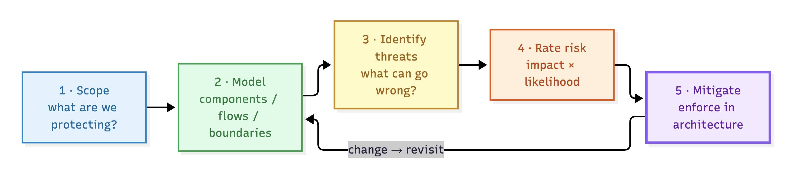

# Threat Modeling Primer

> Threat modeling is the discipline of asking **"what can go wrong with my system — and what should I do about it?"** before attackers — and now, before the *system itself* — answers for you. This lesson gives you the mental model, the vocabulary, and the five-step loop you will use for the rest of the course.

## Why this matters

AI systems fail in new and expensive ways: a prompt can override instructions, retrieved content can carry malware instructions, and an agent with too much authority can take real-world actions. The cost of finding these flaws **after** deployment is orders of magnitude higher than finding them **before** — and many can only be found while the architecture is still on a whiteboard.

Threat modeling is the cheapest place to catch them, because it works on a description of the system before a single line of code exists.

## What threat modeling is (and isn't)

- **It is** a structured way to enumerate what can go wrong, rate how bad it would be, and decide what to do about it.
- **It is** a team activity — security, architecture, and engineering together.
- **It is not** a penetration test. Pentesting tests *known* code; threat modeling finds problems in the *concept*.
- **It is not** a checkbox. A model that nobody updates is a liability, not a control.

## The five-step loop

Everything in this course is one of these five steps applied to AI systems.

> **1. Scope:** 
Decide what you are protecting and what the boundaries are: the system, its data, its users, the surrounding processes.

> **2. Model:** 
Decompose the system into components, data flows, and trust boundaries. This is what the sample diagrams and the tool's component/flow inventories do for you.

> **3. Identify threats:** 
Ask "what can go wrong here?" for each component and flow. You use frameworks — OWASP LLM Top 10, MITRE ATLAS, AI-augmented STRIDE — as a *prompt list*, never as a replacement for thinking.

> **4. Rate risk:** 
Combine impact (how bad) and likelihood (how likely) to prioritize. An unprioritized list of 50 threats is a denial-of-service on the engineers.

> **5. Mitigate:** 
Choose controls that are enforceable in the architecture, not only in the prompt. Then re-run the model to check the design.

> Threat modeling is a **loop**: when a component, flow, or control changes, you go around again.

> [!risk] **What can go wrong?** Across the course you'll keep meeting the same AI failure modes — spot them early and they stop being surprises.
> - Prompt injection hijacks the system's instructions — users (and retrieved documents) override them.
> - Stored data — a vector index, memory, fine-tuning set — gets poisoned, corrupting every future answer.
> - The system has more authority than it needs and uses it (excessive agency).
> - Secrets leak through the model: training data, memory, prompts, PII.
> - Hallucination is trusted as fact by downstream systems and humans (overreliance).

> [!fix] **What can we do about it?** The loop that finds each threat also points at where to enforce the fix.
> - Treat every untrusted input as hostile until it crosses a validated boundary.
> - Never pass model output onward without validating it like any other untrusted input.
> - Scope tools and autonomy to least privilege; require human approval before consequential actions.
> - Keep secrets and raw PII out of context windows and stores that feed them.
> - Make the model a decision *adviser*, with deterministic systems enforcing the outcome.

> [!callout] **The AI-specific shift**
> In a classical system, code is deterministic and data is inert. In an AI system the model is *probabilistic*, the retrieved context is executable *instruction* as well as data, and the system's own tools become an attack surface. New threat categories appear (prompt injection, data poisoning, model theft, excessive agency) that don't map onto classic vulnerabilities. You will meet them all in this course.

## Core concepts to take away

- **Asset** — something of value: the model, the knowledge base, user PII, system integrity, brand.
- **Component** — a piece of the architecture with a role: UI, gateway, guardrails, orchestrator, model, store, tool. Each one can be attacked and each one *holds* risk.
- **Trust zone** — a region of the same trust level. The tool uses four: `UNTRUSTED`, `EDGE`, `INTERNAL`, `EXTERNAL`.
- **Data flow** — any movement of data between components. Every flow crosses a trust boundary at some point; **every boundary crossing is a place a threat can travel**.
- **Trust boundary** — the line between zones where controls must exist (auth, validation, encryption…).
- **Threat** — a specific thing that can go wrong (not a category, a concrete scenario).
- **Risk** — threat × impact × likelihood, before and after mitigations.
- **Mitigation / control** — what reduces the risk: architectural, technical, or procedural.

## In the tool

1. Open the **sample library** on the Threat Modeler home page (`Try a Sample`). You'll see four reference architectures.
2. Open **RAG GenAI** and download the diagram. Spend two minutes just looking before touching anything — you will return to this exact exercise in Lesson 03.
3. Don't run it yet. In Lesson 07 you'll be asked to predict before you run.

## Hands-on exercise

> [!exercise] **Warm-up: see the threats already in the room**
> 1. Pick any sample (e.g. RAG GenAI). Without reading anything, write down **three** things that could go wrong that are *specific to AI* (not "server crash").
> 2. For each, name the single component you would point at as the place it happens.
> 3. Now pick one and sketch (a sentence) what an *attacker* would need to do to trigger it.
>
> Disk-stamp your guesses. You'll compare them against the generated report in Lesson 05.

## Checkpoints

1. What is the difference between a *threat* and a *risk*?
2. Why is threat modeling cheaper than waiting for a real incident?
3. Which of the five steps produces the *component inventory* and *data flow inventory*?
4. Why does every trust-boundary crossing deserve scrutiny in an AI system?
5. Name one reason an AI system can be attacked that a classical system cannot.

## Quick check

> [!quiz]
> 1. Which step of the five-step loop turns an architecture into components, data flows, and trust boundaries?
> - A) Scope
> - B) Model
> - C) Identify threats
> - D) Rate risk
> Answer: B
> 2. Threat modeling is a one-time artifact you produce at design time.
> - A) True — run it once and file it
> - B) False — it is a loop you re-run on every meaningful change
> Answer: B
> 3. Which statement captures a defining AI-era shift?
> - A) AI systems are deterministic and data is inert
> - B) Retrieved content can be executable instruction, not just data
> - C) Components never hold risk in an AI pipeline
> - D) AI has no new threat categories
> Answer: B

## Key takeaways

- Five-step loop: scope → model → identify → rate → mitigate (then repeat).
- Boundaries and data flows are where threats travel; components are where they live.
- AI adds whole new threat classes — the frameworks in the next lessons are your prompt list.
- The tool turns step 2 (model) into step 3 (threats) automatically, so you can spend your effort on rating, mitigation, and review.

## Where to next

You've asked where threats live — before you can hunt them you need a decision-maker for *how* you'll question your system: **Lesson 02 — The Four Questions of Threat Modeling**.