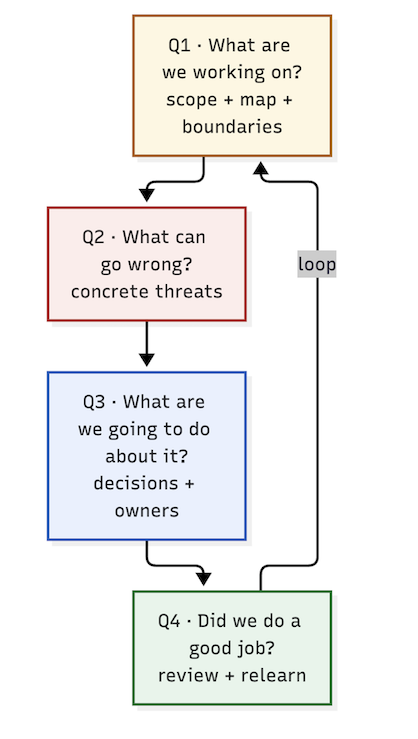

# The Four Questions of Threat Modeling

> The whole practice compresses into four questions — the same four you'll ask on every project, for the rest of your career. 
> Master them and you'll never be lost in a threat model again, no matter which framework the tool happens to cite.

## Why this matters

The "five-step loop" in Lesson 01 is *process*. The **Four Questions** (popularized by Adam Shostack's *Threat Modeling: Designing for Security*) are *purpose*. They make sure every threat model asks the questions that actually matter, in the right order — and that you stop when you've answered them. Frameworks (STRIDE, OWASP LLM Top 10, MITRE ATLAS) are just *helpers for question two*.

The four questions are:

> **1. What are we working on?** 

      **-->** a shared map of the system and its boundaries.

> **2. What can go wrong?** 
      **-->** a structured hunt for the bad things (threats).

> **3. What are we going to do about it?** 
      **-->** decisions, mitigations, and owners.

> **4. Did we do a good job?** 
      **-->** quality, coverage, lessons learned, staying current.

## Question 1 — What are we working on?

You must reach agreement on the *system before you argue about its security*. The deliverable of Q1 is a map: components (`AI-01…`), data flows (`DF-01…`), trust zones and boundaries (`TB-01…`), plus the crucial **out-of-scope items** — what you are *choosing* not to model and why.

- Everyone agrees what's in scope: users, flows, stores, tools, external providers.
- The map is *shareable*: a wrong picture in Q1 → worthless answers in Q2–Q4.
- **AI-specific trap:** Q1 usually stops at "the model." It must include the *pipeline* — ingestion, guardrails, memory, tools, HITL — because that's where the threats live.

The tool's **sample diagrams and component/flow inventories are a Q1 deliverable** — done for you, so `Q1` becomes "review and fix the map" rather than "draw the map."

## Question 2 — What can go wrong?

For every component and flow, ask what fails. This is where the frameworks pay rent: STRIDE, OWASP LLM Top 10, and MITRE ATLAS are *prompt lists* — they make you ask the question instead of staring at a blank page.

- Generate **concrete threats**, not categories: *"a crafted document retrieved from the vector DB injects instructions into the RAG prompt"* beats *"prompt injection"*.
- Attackers matter more than catalogues: read the flows, find them the attacker's path.
- **AI-specific trap:** model output is *untrusted*. Classify "what came back from the model" on the same footing as "what arrived from the user."

The tool **generates this for you** from the pattern catalogs — but you remain the reviewer, because question two is only as good as the map in question one.

## Question 3 — What are we going to do about it?

Decisions, not dreams. Each high-ranked threat gets:

- a **mitigation** that sits on the threat's *path* (which flow/component — see Lesson 08);
- an **owner**, a **due date**, and a **residual-risk sign-off**;
- an explicit **"accept / mitigate / transfer / avoid"** decision, so nothing is silently left on the table.

**AI-specific trap:** "add a guardrail" or "improve the system prompt" is a *hint*, not a decision. A real decision names the control, the point it enforces, and who carries it to production. (This is exactly why the reports pair every threat with a mitigation — review each one with the "can this be overridden by more text?" test.)

## Question 4 — Did we do a good job?

Threat modeling is a *loop*, so Q4 closes it:

- **Coverage:** did we hit every component/flow/boundary? Which findings would have caught the incident we worry about most?
- **Quality:** were the ratings defensible? Did the review find real gaps (see "read critically" exercises in this course)?
- **Currency:** has anything changed since the last pass (a new tool, a new store, a new external call)? A model that never changes is stale the moment the architecture does.
- **Learning:** what do we carry into the next model?

**AI-specific trap:** the model's *behavior* evolves (new features, prompt changes, provider updates). Re-run the loop on change, not on a yearly calendar.

> [!risk] **What can go wrong?** Each question has a classic failure that turns the whole model decorative:
> - Q1 drawn too small: "the model" is scoped, but the pipeline (guardrails, memory, tools, HITL) is skipped — that's where threats live.
> - Q2 answered in categories instead of concrete scenarios — "prompt injection" with no component, no flow, no attacker.
> - Q3 mitigations are prompt-level hopes ("the model will refuse") with no owner or architecture behind them.
> - Q4 never happens — the model runs last year's verdicts against this year's architecture.

> [!fix] **What can we do about it?** The four questions carry their own antidote, IF you respect the order:
> - Q1: define and share the map (components, flows, boundaries) and record what's out of scope — before arguing about any finding.
> - Q2: force each threat through the "who, how, where" filter; STRIDE, OWASP LLM Top 10 and ATLAS are the prompt list.
> - Q3: convert mitigations into decisions with owners and deadlines; a report's mitigation column is a starting point, not the decision.
> - Q4: re-run the loop on every change — new tool, new store, new external call, new prompt.

## In the tool

1. Open a completed sample **report** (e.g. run **Multi-Agent**).
2. For each of the four questions, point at the report section that answers it:
   - Q1 → Component/Data-Flow/Trust-Boundary inventories
   - Q2 → the threat/finding table (with `LLM0x`/`AML.T` tags)
   - Q3 → the mitigation column/table and risk ratings
   - Q4 → your own review notes (the report can't grade itself — see Checkpoints)
3. Notice that the tool turns Q1 into Q2 mechanically, which leaves your energy for Q3 review and Q4 rigour — the two questions where humans add value.

## Hands-on exercise

> [!exercise] **Run all four questions on the same system, twice**
> 1. Pick the **RAG GenAI** sample. Write one confident sentence answering **Q1** (what are we working on) *before* you read the report's inventories.
> 2. Open the report. Diff your Q1 answer against the Component/Data Flow inventories. Any component you missed = a threat you would never have found.
> 3. For **Q2**, take the report's single scariest finding (highest risk rating) and rewrite it as a *concrete* attacker scenario in your own words — then answer "can it be done with the attacker's seat we identified in Q1?"
> 4. For **Q3**, pick that same finding and apply the decision menu: accept / mitigate / transfer / avoid — and name the owner + deadline for the mitigation.
> 5. For **Q4**, list two things you'd change in next week's threat model based on this one. That's the loop closing.

## Checkpoints

1. Write all four questions from memory. What makes Q1 the "gatekeeper" question?
2. Which question do STRIDE / OWASP LLM Top 10 / MITRE ATLAS actually answer — and why do people misplace them in Q3?
3. Give an accept-vs-mitigate example from a real AI product decision.
4. What is the single best signal that a previous threat model "did a good job"?
5. Why must Q4 be re-walked on *change*, not on a calendar?

## Quick check

> [!quiz]
> 1. Which question does the OWASP LLM Top 10 help you answer?
> - A) Q1 - What are we building?
> - B) Q2 - What can go wrong?
> - C) Q3 - What are we going to do about it?
> - D) Q4 - Did we do a good job?
> Answer: B
> 2. The real deliverable of Q1 is:
> - A) a risk rating table
> - B) a shared map of the system, its trust boundaries, and its external dependencies
> - C) the mitigation decision menu
> - D) a lessons-learned review
> Answer: B
> 3. Which is the classic Q1 scope trap in an AI project?
> - A) including too many external tools
> - B) scoping only "the model" and skipping the surrounding pipeline
> - C) re-running the map on every change
> - D) naming component owners
> Answer: B

## Key takeaways

- Four questions: what are we working on / what can go wrong / what will we do about it / did we do a good job.
- Q1 is the map — get it wrong and everything downstream is decorative.
- Frameworks feed Q2; they never replace it. Threats are concrete, not categorical.
- Q3 is decisions with owners; Q4 keeps the loop honest and current.
- The tool accelerates Q1→Q2; your judgment lives in Q3 and Q4.

## Where to next

The Four Questions are the *purpose*; now rebuild the *map* you need to answer them: **Lesson 03 — Trust Zones & Data Flows**.