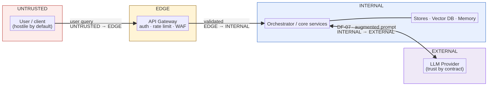

# Trust Zones & Data Flows

> Every attack is a journey. It starts at some input the attacker controls, crosses one or more **trust boundaries**, follows the **data flows**, and lands on an asset. In this lesson you learn to draw the map the attack travels — the zones and flows that every AI threat report is built on.

## Why this matters

A component on its own does nothing. Risk lives in **who can reach it, and with what data**. A vector database that is only reachable through a trusted internal orchestration layer is a different animal from the same database sitting behind an internet-facing API. Knowing your trust zones and data flows tells you *where* the attack surface is and *which controls* must sit on a boundary.

The tool's reports do the mapping for you (DF-xx flows, TB-xx boundaries) — but the map is only useful if you can read it critically and spot where the tool is missing a flow you know exists.

## Core concept: the four trust zones

| Zone | Meaning | Typical occupants | Trust assumption |
|------|---------|-------------------|------------------|
| `UNTRUSTED` | Everything you don't control | End-user browsers, devices, third-party callers | Hostile until proven otherwise |
| `EDGE` | First line you do control | API gateway, reverse proxy, input filters, WAF | Controlled, but touching the untrusted world |
| `INTERNAL` | Your application core | Orchestrator, services, vector DB, memory, guardrails | Trusted internally — but not a free pass |
| `EXTERNAL` | Partners you call out to | LLM provider API, external model hosts, SaaS tools | Trusted *by contract only* |

> [!risk] **What can go wrong?** The zones predict the attacks before you even name them:
> - `UNTRUSTED → EDGE`: the front door — prompt injection, credential attacks, request smuggling against thin validation.
> - `INTERNAL → EXTERNAL`: your data walks out to the LLM provider — confidentiality now depends on a contract, plus whatever the model retains.
> - `EXTERNAL → INTERNAL`: the response comes back *untrusted* — a smuggled payload disguised as an answer.
> - Inside `INTERNAL`: a poisoned store or compromised orchestrator attacks laterally with no boundary to slow it down.
> - Missing boundaries are the silent killer — a flow from `UNTRUSTED` straight to the vector DB is a design flaw, not a gap in filtering.

> [!fix] **What can we do about it?** Every boundary crossing gets a control named by its zone pair:
> - `UNTRUSTED → EDGE`: enforce authn/authz, rate limits, content validation at the gateway/WAF.
> - `EDGE → INTERNAL`: sanitize and validate *before* trusting inside — and re-validate anything that returned from outside.
> - `INTERNAL → EXTERNAL`: redact and minimize what leaves; sign/encrypt; negotiate processing terms (no training on your data).
> - `EXTERNAL → INTERNAL`: treat provider output as untrusted input to the internal layers that consume it.
> - Inside `INTERNAL`: segment stores from orchestrators, validate every ingestion path, and log with tamper-evidence.

Three rules to internalize:

1. **Data is only as trusted as its most recent untrusted crossing.** Anything that arrived from `UNTRUSTED` (or came back from `EXTERNAL`) is attacker-influenced until validated.
2. **`INTERNAL` is not a synonym for "safe".** The orchestrator and the vector DB live on the same side of the boundary — but a malicious document that got *indexed* inside your vector DB now attacks from the inside. Internal components can be the *origin* of a threat, not just a target.
3. **`EXTERNAL` means your data leaves your trust.** The moment a prompt crosses to an external LLM provider, its confidentiality depends on a contract, not on your controls.

## Data flows: the attack's highway

A data flow is a pair: **(source → destination, with a payload)**. The formal body of work is *Data Flow Diagrams* (DFDs). For AI systems, pay attention to four things on every flow:

- **Direction.** Which way does data travel? Responses travelling out can leak; instructions travelling out can be intercepted.
- **Payload.** What exactly crosses — raw query? PII? embeddings? augmented prompt with retrieved context? The payload defines what an attacker can smuggle.
- **Boundary pair.** `UNTRUSTED → EDGE` is your front door; `INTERNAL → EXTERNAL` is your blind spot; `UNTRUSTED → INTERNAL` (e.g. a user hitting the vector DB directly) is a design flaw.
- **AI relevance.** Is this flow carrying *instructions* (prompts, context) or just data? Instruction-carrying flows are the prime injection vectors.

In the RAG pattern, look at DF-07 `Orchestrator → LLM Provider`: the payload is the *entire augmented prompt* — system instructions plus retrieved context plus the user's query. That single flow carries most of the confidentiality risk in the whole system, and it only exists because the zone pair is `INTERNAL → EXTERNAL`.

## In the tool

1. Open a sample diagram (e.g. **Autonomous Agent**). The arrows ARE the data flows; each component belongs to a zone.
2. Open the same sample in the report (`Run sample` → open the HTML report). Find the **Data Flow Inventory** and **Trust Boundary Definitions** tables.
3. Pick flow DF-xx that crosses a boundary and locate that exact crossing in the diagram.

## Hands-on exercise

> [!exercise] **Draw the boundaries before you see them**
> 1. Take the **RAG GenAI** diagram. On a sheet of paper (or mentally), group the components into the four zones **before** checking the report. Mark the lines where a flow crosses a zone edge.
> 2. For each crossing you drew, write one sentence: *what control must exist at this point?* (e.g. "untrusted query must be validated before it reaches the orchestrator").
> 3. Now run the sample and open **Trust Boundary Definitions**. Compare: did the tool's TB-xx list match your drawing? Where does it differ?
> 4. **Critical-read exercise:** the report only knows the flows you give it. Look at the RAG diagram again — is there a *plausible* flow the diagram omits (e.g. a future admin page hitting the vector DB, a logging pipeline that forwards raw prompts to an observability stack)? Add it on paper and note what risks appear that the report did not cover.

## Checkpoints

1. Why must data that returns from an `EXTERNAL` zone be treated as untrusted?
2. Give an example of a threat whose *origin* is inside the `INTERNAL` zone, not at a boundary.
3. Why is DF-07 in RAG (`Orchestrator → LLM Provider`) the highest-leakage flow?
4. A flow from `UNTRUSTED` directly to your vector store — what's the immediate problem?

## Quick check

> [!quiz]
> 1. Which zone describes a partner you call out to, trusted only by contract — never for my data without payback?
> - A) UNTRUSTED
> - B) EDGE
> - C) INTERNAL
> - D) EXTERNAL
> Answer: D
> 2. In the RAG deep dive, which flow carries the highest-leakage risk to a third-party provider?
> - A) USER → GATEWAY
> - B) ORCHESTRATOR → LLM PROVIDER (DF-07)
> - C) GATEWAY → ORCHESTRATOR
> - D) VECTOR STORE → RETRIEVER
> Answer: B
> 3. A flow from UNTRUSTED straight into the vector store is:
> - A) fine as long as the store validates
> - B) a design flaw — trust boundaries are the invariant, not object labels
> - C) typical of every RAG system
> - D) an INTERNAL → EXTERNAL crossing
> Answer: B

## Key takeaways

- Four zones: `UNTRUSTED`, `EDGE`, `INTERNAL`, `EXTERNAL` — boundaries are where controls live.
- Every boundary crossing is an attack opportunity; every `INTERNAL → EXTERNAL` flow is a confidentiality risk.
- Read flows by payload and direction, not just source/destination.
- The tool models the flows you gave it — *you* are responsible for the missing ones.

## Where to next

You can read trust and trustlessness — now learn what the components actually **do**, and which ones carry the AI risk: **Lesson 04 — AI Components & Attack Surface**.