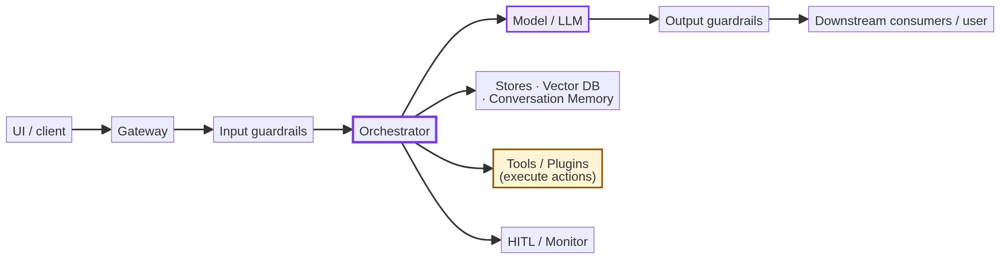

# AI Components & Attack Surface

> An AI system is not "the model". It is a pipeline of components with different jobs, different privileges, and different exposure. This lesson teaches you the **role taxonomy** the tool uses — and why a threat lands on one component and not another.

## Why this matters

When every component has a *job description*, threats become precise. Instead of "the system could be exploited," you get "the **retriever** can be manipulated by a crafted query to pull poisoned context," and the *owner* of that component knows who is responsible for the fix. Component-precise findings are what turn a report into an action plan.

The tool tags every finding with component IDs (`AI-01`, `AI-07`, …). Understanding the roles lets you:
- read a report and know what each ID means without looking it up;
- challenge the tool: *is the injection landing where it says, or would the guardrail absorb it?*
- spot components the tool's catalog doesn't cover for *your* architecture.

## The role taxonomy

These are the hats an AI system's components wear. A component can wear more than one, but the tool lists them separately when it matters.

| Type | What it does | Why it's attackable |
|------|--------------|---------------------|
| **UI (client)** | Browser/app/voice surface | Entry point; the attacker's natural seat; conversation history accumulates |
| **Gateway** | Auth, rate limit, routing, WAF | First line; misconfig = open door; logs full requests |
| **Guardrail (in/out)** | Filters, detection, content policy | Tempting "single control" — bypassable, must not be sole defense |
| **Orchestrator** | Coordinates steps, calls tools/models | Single point of compromise; holds prompts, keys, full instructions |
| **Model / LLM** | The core intelligence (provider or self-hosted) | Prompt injection, hallucination, extraction, leakage at inference |
| **Embedding / auxiliary model** | Converts text↔vectors; rerankers | Model poisoning, supply chain, token flow exposure |
| **Store / Vector DB / Memory** | Knowledge base, chat history, state | Retrieval poisoning, index manipulation, bulk PII |
| **Tool / Plugin** | Function calling, APIs, shell, email, DB | Agent's *execution* power — RCE, data write, exfil |
| **ETL / Ingestion pipeline** | Chunks documents into the store | Training/indexing poisoning — corrupts *future* trust |
| **Template / Config store** | System prompts, few-shots, prompts | System prompt leakage, template injection |
| **HITL / Monitor** | Human-in-the-loop, logging, observability | Bypassed or flooded; logs become a dataset leak |

## Where the attack actually lands

Three insights that explain most of the component→threat mapping you'll see in reports:

1. **The model is rarely the only victim.** Injection attacks *target* the model but *travel* via the orchestrator, retriever, memory, and tools. The report therefore attributes the finding to the components on the attack *path*, not just the endpoint.
2. **Stores are assassination targets.** Poison the vector DB once and every future query inherits the corruption. That's why `AI-06 Vector Database` and `AI-12 Document Pipeline` are flagged in RAG even though they never sit at a user-facing boundary.
3. **Tools are where "thinking" becomes "doing".** An agent can only cause real-world damage if it can *execute*. Tool components (email, HTTP, shell) convert a prompt injection into a data breach or a payment.

> [!risk] **What can go wrong?** Read the pipeline as a chain — every link has its own failure mode:
> - Gateway: misconfigured auth or rate limits let anything through; it also logs full requests (a dataset leak waiting to happen).
> - Input guardrails: the tempting "one control" — bypassable by rephrasing, encodings, or indirect injection that never passes through user input.
> - Orchestrator: single point of compromise — it holds prompts, keys, and full instructions.
> - Model / LLM: injection, hallucination, extraction, leakage at inference time.
> - Stores / vector DB / memory: poison once, corrupt every future answer; bulk PII resides here.
> - Tools / plugins: excessive agency, misuse, RCE — this is where thinking becomes doing.
> - Ingestion pipeline: a poisoned chunk here corrupts the store for everyone who reads it next.
> - Output guardrails: if every downstream re-trusts text, a miss is an incident.

> [!fix] **What can we do about it?** Kill the chain at its weakest links rather than patching symptoms:
> - Gateway: enforce authn/authz, rate limits, and *minimal* logging; redact payloads before they reach the log store.
> - Guardrails: keep them (first layer) but never sole; validate *retrieved* content and *tool output* as rigorously as user input.
> - Orchestrator: least privilege + secrets out of context windows; isolate its blast radius (segment, don't co-tenant).
> - Model: treat provider output as untrusted; negotiate no-training terms; keep PII out of prompts.
> - Stores / memory: input validation + source gating on every write; access control on reads.
> - Tools: scope each to least privilege; HITL on consequential actions; sandbox execution.
> - Ingestion: verify provenance and sanitize every document before chunking/indexing.
> - Everywhere: treat model output as unprivileged data at its destination.

## The AI-## inventory convention

The tool numbers inventory entries `AI-01, AI-02, …` so findings can point at a specific row. Use the same habit in your own diagrams:

- each **component** row = `AI-NN` with type, trust zone, data handled, model access, risk level;
- each **data flow** row = `DF-NN` with source, destination, payload, zone pair;
- each **boundary** row = `TB-NN` with the controls that sit there.

When you review a report, you can trace every finding back to an `AI-NN`/`DF-NN`/`TB-NN` row — "evidence-based" threat modeling.

## In the tool

1. Run the **Single Agent** sample and open the HTML report.
2. Find the Component Inventory. For each of these components — *orchestrator, tool layer, memory, HITL* — read its `Risk Level` and `Model Access` columns and ask *why* it's rated that way.
3. Pick one high-risk component and find a **finding table** (threats/risks/mitigations) that references it. Trace the reasoning: component → threat → why.

## Hands-on exercise

> [!exercise] **Assign the hats — and the blame**
> 1. Take the **Multi-Agent** diagram. Assign every box a role from the taxonomy above (some share a role). Write the role next to each box.
> 2. Rank each component: **exposure** (how reachable), **privilege** (what it can do), **tamperability** (how easy to corrupt the data/instructions it holds).
> 3. The "blame test": an attacker has made the system send a malicious email. List, in order, every component along the attack path and mark which of your ranks made each step possible.
> 4. Compare your final list against a generated **Multi-Agent** report. Which components show up in `LLM08: Excessive Agency` and `LLM01` findings? Did the tool attribute anywhere differently than you did?

## Checkpoints

1. Why does the report attribute injection findings to the retriever/memory *and* the model?
2. What makes a *store* a high-value target even when it's not internet-facing?
3. Which component type converts an agent's "intention" into actual damage, and what threat category does that usually appear under?
4. What do the `DF-`, `AI-`, and `TB-` inventory prefixes mean and why does evidence-based review depend on them?

## Quick check

> [!quiz]
> 1. Why does a report attribute injection findings to the retriever/memory *and* the model?
> - A) Because they are components on the attack path the injection travels
> - B) Because the model is always the only victim
> - C) Because retriever holds secrets
> - D) Because the tool over-attributes by default
> Answer: A
> 2. Which component type converts an agent's "intention" into actual damage?
> - A) Gateway
> - B) Vector DB / memory
> - C) Tool / plugin
> - D) Template / config store
> Answer: C
> 3. Which inventory prefix identifies a data-flow row?
> - A) AI-
> - B) DF-
> - C) TB-
> - D) CF-
> Answer: B

## Key takeaways

- Know the role taxonomy: gateway, guardrails, orchestrator, model, store, tool, pipeline, template store, HITL.
- Risk lands on the component that lets the attack *travel and execute*, not just the model.
- Stores get poisoned; tools get abused; orchestrators concentrate compromise.
- Use `AI-/DF-/TB-` row IDs to trace every finding back to evidence.

## Where to next

Components and flows give you the map. Now you need the framework that tells you what to look for on that map: **Lesson 05 — OWASP LLM Top 10**.