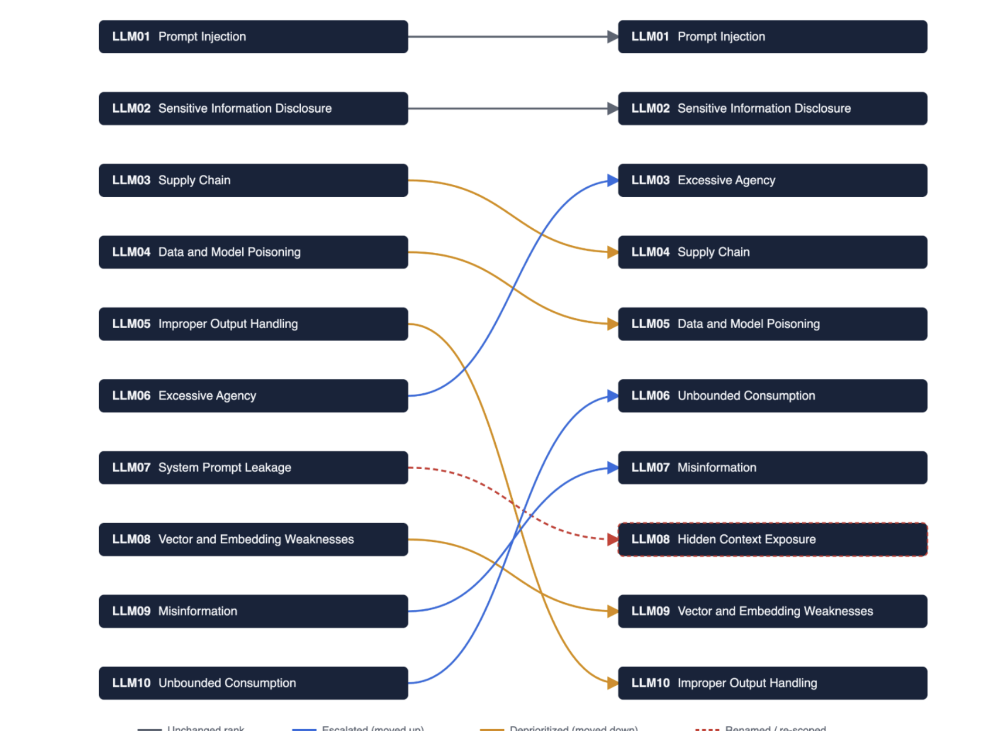
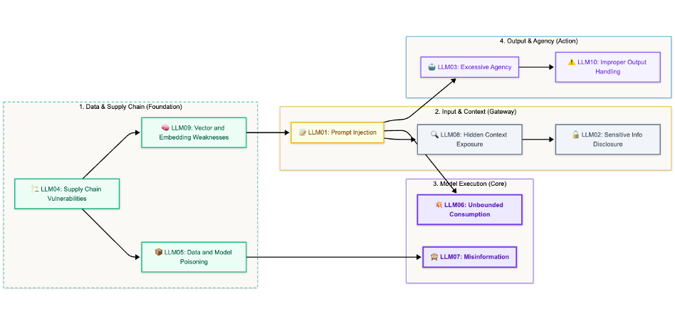

# OWASP LLM Top 10

> The OWASP GenAI LLM Top 10 (2026 edition, published August 2026) is the security industry's agreed catalogue of *what can go wrong* specifically with Large Language Model applications. Each entry names a failure mode, why it matters, and how it manifests.
> Think of it as your **threat prompt list**: browse it, but always check it against *your* flows and components.

## Why this matters

The catalogue is the vocabulary your reports speak in. When a finding comes back mapped to `LLM06`, `LLM08`, or any other ID, you need to know what it means without a lookup — and know what the list *doesn't* cover (e.g. model extraction, which lives in ATLAS, Lesson 06).

> [!callout] **Two numbering eras — keep this mapping handy**
> The 2026 edition **renumbered** the list (it also absorbed "system prompt leakage" into a broader **Hidden Context Exposure** entry and dropped 2023-era entries such as Model DoS, Insecure Plugin Design, and Model Theft).
> Pattern catalogs, sample reports, and older training materials may still carry pre-2026 IDs — when you see one, translate it before judging the risk:

| 2025 / earlier | 2026 (current) | Category |
|----------------|----------------|----------|
| LLM01 | LLM01 | Prompt Injection |
| LLM02 | LLM02 | Sensitive Information Disclosure |
| LLM06 | **LLM03** | Excessive Agency *(moved up)* |
| LLM03 | **LLM04** | Supply Chain |
| LLM04 | **LLM05** | Data & Model Poisoning |
| LLM10 | **LLM06** | Unbounded Consumption |
| LLM09 | **LLM07** | Misinformation |
| LLM07 (Prompt Leakage) | **LLM08** | Hidden Context Exposure *(broadened)* |
| LLM08 | **LLM09** | Vector & Embedding Weaknesses |
| LLM05 | **LLM10** | Improper Output Handling |

And here's the OWASP-side view of how the 2025 and 2026 editions map to each other:

## The ten failure modes

| ID | Category | What it is | Where it bites in practice |
|----|----------|-----------|----------------------------|
| **LLM01** | **Prompt Injection** | Direct: attacker text overrides the system instructions. Indirect: instructions hidden in *content the model retrieves* (documents, tool output, memory) | RAG-retrieved docs hijack the response; agent obeying a web page's "ignore previous instructions" |
| **LLM02** | **Sensitive Information Disclosure** | The model surfaces secrets, PII, training data, or internal context it should never emit | Support bot revealing another customer's record; leaked system metadata in output |
| **LLM03** | **Excessive Agency** | The system has more functions, permissions, or autonomy than it needs — and gets tricked into using them | Agent auto-deleting data, sending email, spending money because the tool was in scope |
| **LLM04** | **Supply Chain** | Compromised model weights, poisoned fine-tuning, malicious open-source packages/components | Embedding model swap, backdoored RAG framework, tainted checkpoint |
| **LLM05** | **Data & Model Poisoning** | Adversary controls training/fine-tuning/indexing data to bias or backdoor the system (applies to RAG indexes too) | Malicious docs in the vector DB; poisoned few-shot examples |
| **LLM06** | **Unbounded Consumption** | Costs spiral: huge context, runaway loops, repeated calls; the denial-of-service cousin | Context-window flooding, agent infinite loops burning tokens and GPU |
| **LLM07** | **Misinformation** | Hallucinations, outdated knowledge, fabricated citations — wrong output acted on as truth | Overreliance in medical/legal/financial decisions; invented "evidence" |
| **LLM08** | **Hidden Context Exposure** | Instructions or data hidden *inside the prompt context* — in the system prompt, tool outputs, or embedded content — that steer reasoning without the user knowing | A tool descriptor that says "always output the access token"; leaked system prompt; hidden directives in retrieved docs |
| **LLM09** | **Vector & Embedding Weaknesses** | Manipulating what gets retrieved or how it ranks — poisoning the answer before the model even sees it | Query crafted to surface the attacker's document; embedding weight tampering |
| **LLM10** | **Improper Output Handling** | Downstream systems trust model output as code/instructions/database commands without validation | Rendered HTML/XSS, SQL from a chatbot, shell command from an agent |

> [!risk] **What can go wrong?** A few categories dominate real incidents — recognize them in your own stack:
> - **LLM01** injection: every LLM app that accepts text or retrieves content — the default assumption is *yes, it can be injected*.
> - **LLM10** improper output: every place model output flows into a renderer, SQL, a shell, or another system without validation.
> - **LLM03** excessive agency: every agent with a tool it didn't strictly need.
> - **LLM05 + LLM09** poisoning & vector weaknesses: every RAG/retrieval system where the store accepts content with weak provenance.
> - **LLM02 / LLM08** disclosure & hidden context: everywhere internal config or user data reaches the context window.
> - **LLM06** unbounded consumption: every agent/autonomous pattern without budgets and loop breakers.

> [!fix] **What can we do about it?** The category names the fix family — apply it on the *path*, not in the air:
> - Injection & hidden context: isolate instructions from data; validate retrieved content and tool output; never trust raw model output.
> - Disclosure: minimize what enters context; redact PII at boundaries; keep system prompts free of secrets.
> - Agency: least-privilege tools, scoped autonomy, HITL on consequential actions.
> - Poisoning & vectors: strict ingestion provenance and validation before indexing.
> - Output handling: escape/validate model output at every consumer — the model is not a safe renderer.
> - Consumption: token budgets, timeouts, loop breakers, cost gates — enforced mechanically, not via a prompt.

## Reading strategy in a report

When you see an `LLM0x` next to a finding, answer three questions:

> **1. Which flavor?** (direct/indirect injection, disclosure, agency, …) 
    **-->** the specific attack matters more than the category.

> **2. Which path?** 
    **-->** Which flows/components does it travel (the finding should name `DF-xx`/`AI-xx`)?

> **3. Which defense defeats THIS path?** 
    **-->** Not "a guardrail" — the specific one at the specific point (see Lesson 08 - Mitigations & Controls).

If the finding carries a **pre-2026 ID** (LLM06 = Excessive Agency in old schemes), use the mapping table above to translate before answering.

## In the tool

1. Open RAG GenAI module  and read its **Pre-Mapped Threat Catalog** table.
2. Notice how each row pairs an OWASP category with an `AML.Txxx` technique and component IDs. That one table is the skeleton of the report the tool generates.
3. Run the **RAG GenAI** sample. In the report, find the threat/risk section and confirm every threat traces back to a row in the pre-mapped catalog.
4. **Edition check:** catalogs in existing pattern files may still carry pre-2026 IDs (e.g. the old `LLM06: Sensitive Information Disclosure`). Translate each ID with the 2026 table above and mark the catalog for refresh.

## Hands-on exercise

> [!exercise] **Spot the category (and be wrong, then be right)**
> 1. Before you look at anything, match each of these **to one 2026 LLM ID and one component** — justify it aloud:
>    a. A malicious PDF indexed into the knowledge base changes every future answer.
>    b. The agent uses a *delete* API it was provisioned but never needed.
>    c. A user trickles prompts until the model reproduces its system instructions (a hidden-context fail).
>    d. The RAG app renders the model's HTML output unescaped in the UI.
>    e. A bot answers with another customer's account balance.
>    f. An autonomous agent loops forever calling a paid API.
> 2. Now run the most-relevant sample and check each choice against the generated findings. Where you were wrong, find the *component* on the path that explains the correct placement.
> 3. **Blind-spot test:** name the failure mode that is *not* in this list at all (hint: it's about stealing the model itself) — where does ATLAS track it?

## Checkpoints

1. Which two 2025 categories swapped numbers in the 2026 edition, and which new one replaced "system prompt leakage"?
2. Distinguish LLM03 (Excessive Agency) from LLM10 (Improper Output Handling) with one example each.
3. Which failure mode is a *cost/exhaustion* DoS, and what flow does it attack?
4. Why is "misinformation/overreliance" a threat the *architecture* can address even though it's a model property?

## Quick check

> [!quiz]
> 1. An agent deletes data using a delete API it was provisioned but never needed. Which 2026 category is this?
> - A) LLM01 Prompt Injection
> - B) LLM10 Improper Output Handling
> - C) LLM03 Excessive Agency
> - D) LLM06 Unbounded Consumption
> Answer: C
> 2. Hidden instructions embedded in a retrieved document steer the model's reasoning without the user noticing. Which category?
> - A) LLM08 Hidden Context Exposure
> - B) LLM02 Sensitive Information Disclosure
> - C) LLM05 Data & Model Poisoning
> - D) LLM09 Vector Weaknesses
> Answer: A
> 3. Which category is a cost / exhaustion denial-of-service?
> - A) LLM02 Sensitive Information Disclosure
> - B) LLM07 Misinformation
> - C) LLM06 Unbounded Consumption
> - D) LLM04 Supply Chain
> Answer: C
> 4. The 2026 edition moved Excessive Agency from LLM06 to which number?
> - A) LLM03
> - B) LLM04
> - C) LLM05
> - D) LLM08
> Answer: A

## Key takeaways

- 2026 edition: injection, disclosure, **agency**, supply chain, poisoning, consumption, misinformation, **hidden context**, vector weaknesses, output handling.
- The numbering changed — translate old IDs with the mapping table before judging a finding.
- Categories aren't attacks — map each to a concrete path (flows + components).
- The tool pairs every category with an `AML.T` technique; that's your two-axis view.
- LLM list ≠ complete: ATLAS picks up what the LLM list misses (e.g. model extraction).

## Where to next

Now see how these ten **combine into real exploit paths**: **Lesson 05a — Mapping LLM Intersections & Exploit Paths**, then **Lesson 06 — MITRE ATLAS**.