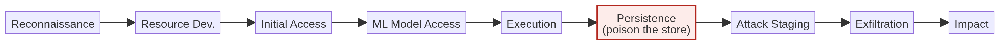

# MITRE ATLAS

> MITRE ATLAS (Adversarial Threat Landscape for Artificial-Intelligence Systems) is the adversary's playbook for machine-learning systems: a matrix of **techniques and tactics** — *how an attacker actually accomplishes* the failures OWASP describes. The tool's catalogs tag every finding with ATLAS technique IDs (`AML.T0051`, `AML.T0020`, …) so that "prompt injection" becomes a specific, referenceable step in an attack chain.

## Why this matters

OWASP tells you *what broke*. ATLAS tells you *how it was done*. The two together give you:

- a **tactic** (the goal of the step — e.g. *initial access*, *execution*, *exfiltration*);
- a **technique** (the concrete method — e.g. *indirect prompt injection*);
- an **AML ID** you can grep for in reports, incident write-ups, and NIST/EU discussions.

When a report cites `AML.T0054.002`, you know exactly which book entry to open.

## Reading an ATLAS ID

`AML.T0054.002` breaks down as:

- `AML` — ATLAS technique namespace
- `T0054` — the technique number (today: *Excessive Agency*)
- `.002` — the sub-technique variant (e.g. *goal manipulation* among the agency variants)

You don't memorize IDs — you learn to recognize the *family* and let the reports carry the precision.

## The techniques in your pattern catalogs (and what they mean)

| AML ID | Technique family | Sub-variants seen here | In plain words |
|--------|------------------|------------------------|----------------|
| **AML.T0051** | Prompt Injection | `.004` direct, `.005` indirect, `.006` multi-agent, `.007`, `.008` variants | Attacker text controls the model's instructions |
| **AML.T0020** | ML Artifact Poisoning | — | Training/fine-tuning/RAG data is sabotaged |
| **AML.T0024** | Exfiltration via ML Inference | — | The model leaks data through *legitimate* outputs |
| **AML.T0025** | ML Model Extraction | — | Repeated queries reconstruct model behavior/weights |
| **AML.T0043** | Denial of ML Service | — | Resource exhaustion, context flooding, runaway loops |
| **AML.T0010** | ML Supply Chain Compromise | — | Tainted weights, backdoored libs, poisoned base models |
| **AML.T0052** | Malicious/Unwanted AI Behavior | — | Where overreliance and hallucination-driven harm are tracked |
| **AML.T0054** | Excessive Agency | `.001`–`.007`: tool abuse, goal hijacking, collusion, delegation-chain escalation | The system takes *actions* it shouldn't |

> [!callout] **The two-axis habit**
> Read a finding as a pair: **failure mode (OWASP) × method (ATLAS)**. *"LLM08 Vector & Embedding Weaknesses / AML.T0020 ML Artifact Poisoning"* tells the fix target: not "make the model safer" but "make the *index* safe." Get the method right and the mitigation targets itself.

## Tactics, not just techniques

ATLAS also groups techniques under **tactics** — the phases of an attack:

- **Reconnaissance** → **Resource Development** → **Initial Access** →
  **ML Model Access** → **Execution** → **Persistence** (planting data for later) →
  **ML Attack Staging** → **Exfiltration** → **Impact**.

RAG poisoning is a beautiful example of a full chain: *poison the index* (persistence) → *wait* → *a user retrieves it* (execution) → *instructions hijack the model* → *data or damage exits*. Mitigate at the persistence step and the whole chain dies upstream.

> [!risk] **What can go wrong?** ATLAS shows attacks are *chains*, so a diagram with a single "weak spot" is rarely safe:
> - Someone can reach your model or API with valid-looking requests (initial access is easy for LLM apps).
> - Persistent corruption — poisoning a store, fine-tuning, or memory — pays off for attackers *long after* they've left.
> - Model access ≠ execution: even "read-only" model access enables extraction (`AML.T0025`) and laundering in/out of data.
> - Exfiltration is often invisible because it exits through the model's *normal* output — no classic "leak channel" to spot.
> - Governance-stage failures look like "no technique": no logging, no tamper-evidence, no rollback path — and those become real incidents at incident time.

> [!fix] **What can we do about it?** Defend the chain upstream — kill persistence and access, and the later stages can't fire:
> - Treat access to the API/model as a privileged entry point: authn/authz, rate limits, anomaly detection on request patterns.
> - Harden the *persistence* step: strict ingestion provenance, validation before indexing, scanning for injected payloads.
> - Assume every retrieve is attacker-influenced: sanitize retrieved context before it joins the prompt.
> - Make extraction expensive: rate/limit queries against the model, monitor for distillation-style patterns.
> - Keep tamper-evident logs and a tested rollback path (store snapshot swap, model revert) so response is a procedure, not a scramble.

## In the tool

1. Open `patterns/single-agent.md` (or any pattern) → **Pre-Mapped Threat Catalog**.
2. Group every `AML.T…` row by **technique family** and note which *tactic* you'd put it in.
3. Run the sample. In the report's findings, find one `AML.T0054` row and read what the *fix* says — does the mitigation target the technique (scoped tools, HITL) or just the symptom?

## Hands-on exercise

> [!exercise] **Build an attack chain from technique cards**
> 1. Using only the technique table above as your "card deck", construct a full kill chain for this scenario: *an attacker arrests a company's RAG chatbot into emailing their own network diagrams to them.*
>    - Assign one ATLAS technique to *each* phase: persistence → access → execute → exfil.
>    - Say which tactic each card belongs to.
> 2. Now flip it into a **defense chain**: for each card, name the component + control (Lesson 08 will deepen this) that would block that *specific* step. Note how a good mitigation chain has no single point of failure.
> 3. Run **Multi-Agent** and find where ATLAS would place **collusion** (`AML.T0054` / multi-agent injection variant `.006`) vs a single-agent version. What changed in the *chain*?

## Checkpoints

1. Decode `AML.T0051.005` — family, technique, variant, plain meaning.
2. Why does poisoning usually map to *persistence* as a tactic?
3. Give the OWASP/ATLAS pair you'd assign to "an external caller triggers a huge context and burns API budget."
4. When would a report carry an ATLAS technique but no OWASP category (and why)?

## Quick check

> [!quiz]
> 1. `AML.T0051.005` decodes to which technique and variant?
> - A) Excessive Agency, direct variant
> - B) Prompt Injection, direct variant
> - C) Prompt Injection, indirect variant
> - D) ML Model Extraction
> Answer: C
> 2. Why does data poisoning usually map to the *persistence* tactic?
> - A) It plants corrupted data that fires later, when it is retrieved
> - B) It happens during reconnaissance
> - C) It is an exfiltration technique
> - D) It is a denial-of-service step
> Answer: A
> 3. Which pair gives you both the failure mode and the method?
> - A) OWASP category × component ID
> - B) OWASP (the what) × ATLAS (the how)
> - C) STRIDE letter × OWASP only
> - D) AML ID × trust zone
> Answer: B

## Key takeaways

- ATLAS = the how; OWASP = the what; use them as a pair.
- Recognize the AML families by plain meaning — IDs travel with the reports.
- Technique-grade thinking points mitigations at the *method*, not the symptom.
- Attack chains cross tactics: kill the chain at **persistence/access**, upstream of the damage.

## Where to next

Both frameworks share a deeper ancestor — the classic Microsoft STRIDE threat app. See how it adapts to AI: **Lesson 07 — AI-Augmented STRIDE**.