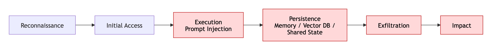

## AI Attack Chains & Kill Chains

> Threats rarely occur alone. Attackers chain them together. Prompt injection is usually not the objective. It is often the opening move.Most successful AI attacks follow a sequence: influence → persistence → action → impact

This lesson introduces AI kill-chain thinking and teaches you how to identify the entire attack path instead of a single finding.

## Why this matters

Security teams often focus on the first visible problem.

Attackers focus on the entire path to impact.

 - A prompt injection finding is useful.

 - A prompt injection attack chain is actionable.

> [!grid] Attack-chain thinking helps you:
> 
> - identify upstream controls
> - understand blast radius
> - prioritize mitigations
> - stop attacks before damage occurs
> - explain risk to leadership

> OWASP tells you what failed.

> MITRE ATLAS tells you how it failed.

> Attack chains explain how the attacker moved from one step to the next.

---

## The anatomy (read the diagram)

### Most AI attacks follow six phases:

| Phase | Purpose |
|---------|---------|
| Reconnaissance | Learn how the system works |
| Initial Access | Gain influence into the system |
| Execution | Affect model reasoning |
| Persistence | Survive beyond the session |
| Exfiltration | Remove information |
| Impact | Cause business consequences |

Not every attack uses every phase.

The most damaging attacks typically do.

> The goal of threat modeling is to identify where the chain can be broken earliest.

> [!grid=callout] 
> ## Phase 1: Reconnaissance
> The attacker learns:
> 
> - available models
> - supported tools
> - prompt behavior
> - exposed APIs
> - retrieval sources
> - system limitations
> 
> Examples:
> 
> - prompt probing
> - model fingerprinting
> - tool discovery
> - endpoint enumeration
> 
> ***Reconnaissance typically creates no alerts and appears legitimate.***
> ---
> ## Phase 2: Initial Access
> 
> The attacker gains influence.
> 
> Possible entry points include:
> 
> - chat interfaces
> - API endpoints
> - uploaded documents
> - memory systems
> - tool outputs
> - shared state stores
> 
> The user prompt is not the only entry point.
> 
> ***Many AI attacks arrive through data rather than humans.***
> ---
> ## Phase 3: Execution
> 
> The attack influences reasoning.
> 
> Common examples:
> 
> - direct prompt injection
> - indirect prompt injection
> - instruction hijacking
> - goal manipulation
> 
> Typical mapping:
> 
> - OWASP LLM01
> - AML.T0051
> 
> ***Execution is the point where the model begins behaving differently than intended.***
> ---
> ## Phase 4: Persistence
> 
> The attack survives.
> 
> Examples:
> 
> - poisoned memory
> - poisoned vector databases
> - poisoned documents
> - poisoned training data
> - corrupted shared state
> 
> Typical mapping:
> 
> - OWASP LLM04
> - AML.T0020
> 
> ***Persistence is important because the attack continues after the attacker leaves.***
> ---
> ## Phase 5: Exfiltration
> 
> Sensitive information leaves the system.
> 
> Examples:
> 
> - customer information
> - source code
> - system prompts
> - secrets
> - internal business data
> 
> Typical mapping:
> 
> - OWASP LLM02
> - AML.T0024
> 
> ***Exfiltration often occurs through completely valid responses.***
> 
> The output channel becomes the leak channel.
> ---
> ## Phase 6: Impact
> 
> The final business consequence occurs.
> 
> Examples:
> 
> - unauthorized actions
> - financial loss
> - operational disruption
> - data exposure
> - regulatory violations
> 
> Typical mapping:
> 
> - OWASP LLM06
> - AML.T0054
> 
> ***Impact is usually the phase executives notice.***
> 
> The previous phases created the condition.
> 

## The attack chains hidden inside your patterns

> **1. RAG Pattern**

A common chain:

**Malicious Document**
→ Retrieval
→ Indirect Prompt Injection
→ **Sensitive Data Disclosure**

The attack began in the corpus.

The impact appeared in the answer.

> **2. Single-Agent Pattern**

A common chain:

**Prompt Injection**
→ Tool Abuse
→ **Unauthorized Action**

The attack began as text.

The impact became action.

> **3. Multi-Agent Pattern**

A common chain:

**Malicious Message**
→ Agent Delegation
→ Shared State Poisoning
→ **Cross-Agent Influence**

The attack propagates through collaboration.

> **4. Autonomous Agent Pattern**

A common chain:

**Observation Poisoning**
→ Goal Drift
→ Autonomous Escalation
→ **Business Impact**>

The attack propagates through the execution loop.

---

## The three phases that matter most

Not all phases have equal value.

The best control points are:

> **Initial Access**
>
> - Stop attacks before influence is established.

>  **Persistence**
>
> - Stop attacks from surviving.

>  **Execution**
>
> - Prevent attacker control of reasoning.

If these phases are broken, downstream impact becomes dramatically less likely.

---
> [!risk] **What can go wrong?**
>
> Teams often focus only on execution.
>
> Attackers continue toward:
> 
> - persistence
> - exfiltration
> - business impact
> 
> The later the attack is detected:
> 
> - the more expensive recovery becomes
> - the larger the blast radius becomes
> - the longer remediation takes
> 
> A blocked prompt injection is an incident.
> 
> A successful prompt injection plus persistence is a crisis.

> [!fix] **What can we do about it?**
> 
> Break the chain upstream:
> 
> - validate external content
> - isolate memory
> - enforce least privilege
> - verify tool usage
> - monitor retrieval paths
> - require approval for sensitive actions
> - prevent persistence before it occurs
> 
> The earlier a chain is broken, the lower the risk.

## In the tool

Open any pattern report.

For each threat:

Identify:

- entry point
- execution mechanism
- persistence mechanism
- exfiltration path
- business impact

Now ask:

"Where could this chain have been stopped one phase earlier?"

That is usually where the strongest control belongs.

## Hands-on exercise

> [!exercise] **Build the attack chain**
> 
> Choose one finding from any pattern report.
> 
> Create a six-step chain:
> 
> 1. Reconnaissance
> 2. Initial Access
> 3. Execution
> 4. Persistence
> 5. Exfiltration
> 6. Impact
> 
> Now identify:
> 
> - which phase happened first
> - which phase created the greatest risk
> - which phase is easiest to defend
> 
> Repeat with another finding.
> 
> Compare the chains.
> 
> Do they share a common step?
> 
> That common step often becomes the highest-value control point.

## Checkpoints

- Why are attack chains more valuable than isolated findings?
- Which phase allows attacks to survive after the attacker leaves?
- Why does exfiltration often appear legitimate?
- What phase normally contains prompt injection?
- Which phase produces business consequences?
- Why do architects prefer upstream mitigations?

## Quick check
> [!quiz]
> Test your understanding before moving on.
>
> 1. Prompt Injection most commonly occurs in which attack-chain phase?
> - A) Reconnaissance
> - B) Execution
> - C) Impact
> - D) Recovery
> Answer: B
>
> 2. Why is poisoning considered a persistence attack?
> - A) It survives after the attacker leaves
> - B) It increases token usage
> - C) It changes the UI
> - D) It improves retrieval
> Answer: A
>
> 3. What is usually the best phase to stop an AI attack?
> - A) Impact
> - B) Exfiltration
> - C) Initial Access or Persistence
> - D) Recovery
> Answer: C
>
> 4. A poisoned vector database most directly represents which phase?
> - A) Detection
> - B) Response
> - C) Persistence
> - D) Recovery
> Answer: C
>
> 5. The cheapest place to stop an attack is usually:
> - A) Impact
> - B) Exfiltration
> - C) Upstream
> - D) Recovery
> Answer: C

---

## Scenario quiz
> [!quiz]
>
> 1. An attacker uploads a poisoned document: Three weeks later a user retrieves it. The model follows hidden instructions and exports data. Which phase allowed the attack to survive?
> - A) Reconnaissance
> - B) Persistence
> - C) Recovery
> - D) Detection
> Answer: B
>
> 2. An attacker studies prompt behavior before attempting injection. Which kill-chain phase is occurring?
> - A) Impact
> - B) Persistence
> - C) Reconnaissance
> - D) Exfiltration
> Answer: C
>
> 3. A successful prompt injection causes an autonomous agent to create unauthorized purchase orders. What phase represents the business consequence?
> - A) Execution
> - B) Persistence
> - C) Impact
> - D) Exfiltration
> Answer: C
>
> 4. An attacker stores hidden instructions in a long-term memory store that remain active for months. Which phase is represented?
> - A) Reconnaissance
> - B) Persistence
> - C) Impact
> - D) Exfiltration
> Answer: B
>
> 5. A model reveals sensitive financial records during an otherwise normal conversation. Which phase is occurring?
> - A) Reconnaissance
> - B) Persistence
> - C) Governance
> - D) Exfiltration
> Answer: D

---

## Key takeaways

- Attackers chain techniques together.
- Prompt injection is usually a step, not the objective.
- Persistence changes a temporary attack into a long-lived attack.
- Exfiltration frequently occurs through legitimate outputs.
- Breaking the chain upstream is more effective than reacting downstream.
- Threat modeling should identify where the chain can be interrupted earliest.

## Where to next

Attack chains tell us how attacks travel through systems.

Next we learn how classic threat modeling adapts to GenAI:

**Lesson 07 — AI-Augmented STRIDE**