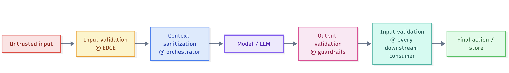

# Mitigations & Controls for AI

> Finding threats is only half the job. The other half is choosing a **control that the architecture will actually enforce** — because in AI, the most common wrong answer is *"a better prompt."* 
>This lesson gives you the defense toolkit and the single rule that separates real controls from wishful thinking.

## Why this matters

The reports the tool generates attach a *mitigation* to every risk. A mitigation is only worth anything if:

1. it sits on the **path** the threat traveled (you control the flow, not the theme);
2. it is **enforced**, not requested (a filter the model can be told to ignore is not a control);
3. it is **defense in depth** (no single control bears all the weight).

Borrowing from Wargames: the only winning move is to architect so the model is never the *last* line of defense.

## The rule: prompts are NOT controls

Repeated for emphasis, because it is the #1 review failure:

> Any mitigation that can be *overridden by more text* is not a control. "Tell the model never to reveal system instructions" is a **hint**; removing the secrets from the context window is a **control**.

| "Prompt-only" (fails review) | Architectural control (passes) |
|------------------------------|--------------------------------|
| "Model must refuse instruction-following" | Input guardrail at `EDGE`, validated system+user separation, sanitized retrieved context |
| "Don't leak PII" | PII redaction at the boundary; PII excluded from the stored corpus; scoped access |
| "Agent should ask before using tools" | HITL approval policy enforced by the *tool layer*, not by the model's willingness |
| "Never emit harmful output" | Output validation/escaping + downstream input validation (defense in depth) |
| "Answer from the corpus only" | Retrieval with strict source gating + citation verification |

## The defense toolkit (apply per threat path)

| Control family | What it does | Typical placement | Defeats |
|----------------|--------------|-------------------|---------|
| **Isolation & de-privileging** | Reduce what any component can see/do; least privilege end-to-end | Tool layer, orchestrator, memory, vector DB | Excessive agency, injection weaponized via tools, supply chain spread |
| **Validation on untrusted input** | Treat all `UNTRUSTED`/`EXTERNAL`-derived content as hostile until checked | EDGE guardrails, retriever front, document pipeline | Direct & indirect injection, poisoning of the index |
| **Sanitizing the context** | Separating system instructions from retrieved content; stripping instructions from retrieved docs | Orchestrator, context assembly | Indirect injection, prompt template tampering |
| **Redaction & minimization** | Don't have the data where it can be leaked | Boundaries, stores, memory | Information disclosure, exfiltration at inference |
| **Every output is data again** | Model output goes through the same validation as any untrusted input **on the way in** | Output guardrails, downstream services, UI renderers | Improper output handling, XSS, SQL/hcl injection, ignoring hallucination |
| **Observability & limits** | Budgets, timeouts, loop breakers, logging with tamper evidence | Orchestrator, monitor, cost gates | Unbounded consumption / DoS, repudiation doubts |
| **Human-in-the-loop** | Structured approval for consequential actions (not "approve everything") | Tool layer, executor, autonomous loops | Excessive agency, irreversible damage |
| **Kill switch & fail-safe** | Deterministic stop: disable tools/agent, cut provider access | Deployment/orch layer, incident response | Runaway autonomy, multi-agent cascade |

> [!callout] **Every control belongs to a path, not a category**
> A control's job description is *"threat X on path Y."* When you write a mitigation, pair it with the flow it sits on: *"reject retrieved content containing instruction delimiters at `AI-07` retriever output, before it joins the prompt in DF-07."* If you can't point at the flow, you haven't designed the fix yet.

> [!risk] **What can go wrong?** Misplaced controls fail in predictable ways:
> - A single guardrail is bypassed — by rephrasing, encoding, or indirect injection that never touches it.
> - "The model will refuse" — it won't, reliably; prompts are data to the model.
> - All-in-on-HITL — people rubber-stamp everything, and the approval becomes theater.
> - Logs with no write protection provide no evidence at incident time — repudiation wins.
> - A model-side "safety" layer is treated as a control and the first real attacker learns it is a hint.

> [!fix] **What can we do about it?** Layer the defenses along the path, enforce each one architecturally:
> - Validate at ingress, sanitize what the model retrieves, validate what it returns, then validate again at each consumer.
> - Remove the option to do harm: least-privilege tools, scoped autonomy, secrets out of contexts, PII minimized at rest and in prompts.
> - Make HITL consequential-only, with deterministic gates (a policy the tool layer enforces, not a promise the model keeps).
> - Keep append-only, signed logs; snapshot your stores and models so you can prove *how* it was, before and after.
> - Test the controls: for each one, write the attack that would bypass it, then keep the layers that survive.

## Where the toolkit must NOT sit

> **Model-side illusions:** 
    **-->** "guardrails inside the model," "safety-trained alone to be safe," "the model will refuse." Keep them as *first* layers, never sole.
> **Un-scoped HITL:** 
    **-->** a human approving every call trains people to rubber-stamp. Approve *consequential* steps, automate the trivial ones.
> **Logs-as-only-evidence with no write protection:** 
    **-->** immutable, append-only, and signed if audit matters (repudiation).

## In the tool

1. Run the **Single Agent** sample and list the mitigations in the report.
2. For each, annotate: *which control family?* *which flow/component does it sit on?* *Fails-review or passes-review?*
3. Find one mitigation and actively **attack it**: can a user override it with text? If yes, what architectural replacement would you propose?

## Hands-on exercise

> [!exercise] **Design the defense chain first, compare after**
> 1. Take **Multi-Agent** and your STRIDE-PIMT sheet from Lesson 07. For the threats you judged *worst*, write a mitigation **as an architecture** (choose the family + the exact flow/component + the enforcement point). Aim for at least two layers per threat.
> 2. Now run the sample. For each generated mitigation, grade the tool's fix with the **passes-review test**. Where it fails, write your replacement.
> 3. **Regression mental model:** add to the diagram one change that would re-open a mitigated path (e.g. "logs forward raw prompts to the observability stack"). Run it as a new job and confirm the report surfaces new exposure. This is the *loop* working.

## Checkpoints

1. Why is "the model will refuse" not a control? Give the text-override counter-example.
2. Least privilege in an AI system — name the two components it protects most.
3. When is HITL *wrong* as a mitigation, and what do you replace it with?
4. What makes a kill switch a control where a "stop button in the prompt" is not?
5. Complete the sentence: "A mitigation must name the _____ it sits on."

## Quick check

> [!quiz]
> 1. Which of the following is a symptom — a hint, not a control?
> - A) PII redaction at the boundary
> - B) "The model will refuse to reveal system instructions"
> - C) Least-privilege tools
> - D) Append-only, signed logs
> Answer: B
> 2. A mitigation is only real when it names the _____ it sits on.
> - A) threat category
> - B) path (flow or component), and is enforced there
> - C) framework edition
> - D) sprint backlog
> Answer: B
> 3. When is HITL *wrong* as a mitigation?
> - A) When it is applied only to consequential actions
> - B) When it gates every single call, training people to rubber-stamp
> - C) When it is enforced by the tool layer
> - D) When it has deterministic policy gates
> Answer: B

## Key takeaways

- Prompts are guidance; architecture is control. Everything else is a hint.
- Defense in depth: validate at ingress, sanitize context, treat every output as re-entering the system.
- Controls pair with a **path** (flow/component) or they don't exist.
- Human-in-the-loop and kill switches must be *enforced by the layer that executes the action*.

## Where to next

Foundations complete. The deep-dives apply all of it to real patterns — start with the one nearest your workload: **Lesson 09 (next) or one of the Pattern Deep Dives** (RAG GenAI, Single Agent, Multi-Agent, Autonomous Agent).