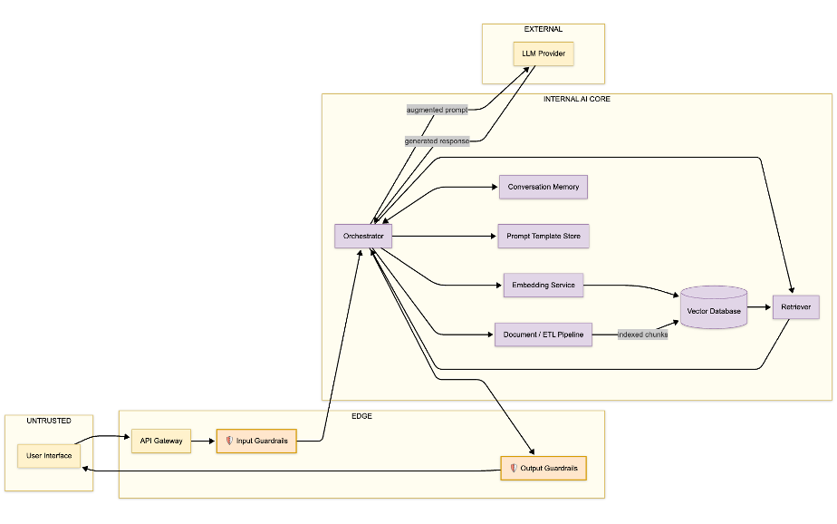

# Deep Dive: RAG GenAI

> Retrieval-Augmented Generation (RAG) is the most common way teams ship LLM value today — and its defining trick is also its defining weakness: 
>**the system treats external content as information, while an attacker treats it as instructions.** 
> This lesson walks the full **RAG GenAI** catalog so you can read (and trust, and challenge) its report.

## Why this matters

RAG solves hallucination-by-constraint: instead of asking a naked model, you *retrieve the answer first* and feed it as context. The cost is a new attack surface the model alone never had:

> - the **knowledge base** 
    **-->** becomes a file anyone can poison;

> - the **retrieval step** 
    **-->** becomes a place to manipulate *which* context gets trusted;

> - the **augmented prompt** 
    **-->** inside the LLM call now mixes system instructions with attacker-influenced content — automatically, on every request.

Every RAG system you touch inherits this surface. Learn the catalog here once; you'll map every other RAG deployment onto it.

---

## The anatomy (read the diagram)

### The pattern is three strips:

> **1. The request strip:** 
    **-->** `User → API Gateway → Input Guardrails → Orchestrator` (`DF-01…DF-03`) — where the *user's* text arrives.

> **2. The retrieval strip:**
    **-->** `Orchestrator → Embedding → Vector DB → Retriever → Context assembly` (`DF-04…DF-06`) — where *stored* text is fetched.

> **3. The generation strip:** 
    **-->** `Context assembly → LLM → Output Guardrails → User` (`DF-07…DF-10`) — where the two meet and the answer leaves.

---

### Three seams matter most (`AI-` IDs from the inventory):

| Seam | Components | Why it's the seam |
|------|-----------|-------------------|
| **System ↔ user** | `AI-01/02/03` | The user's text is only text… until it isn't. |
| **Corpus ↔ prompt** | `AI-06/07/04` | Retrieved chunks become *commands* the moment they join the context. |
| **System ↔ provider** | `AI-04/08` | Your whole context leaves your trust on `DF-07` (`INTERNAL → EXTERNAL`). |

The memory seam (`AI-10`, `AI-12`) quietly accumulates on every turn and every document ingest — poison there and you don't attack one answer, you attack the *habit*.

---

## The catalog, walked threat-by-threat

Every row of RAG GenAI Pattern's Pre-Mapped Threat Catalog, grouped by failure mode:

> [!grid=risk] 
> **1. Prompt injection — the main event (`LLM01`)**
> - **Indirect** (`AML.T0051.005`, via `AI-03/04/07/08`): a document in the vector DB is crafted to contain instructions. Every user who retrieves it inherits them. This is RAG's > signature threat — *the retrieved context is the vector*.
> - **Direct** (`AML.T0051.004`, via `AI-01/03/04`): the user overrides system instructions outright. Guardrails at `AI-03` are first-line, never sole.
> ---
>  **2. Poisoning the index (`LLM03`, `AML.T0020`, via `AI-06/12`)**
> -  malicious documents indexed through `DF-11`. The catalog's classic *persistence* step: one bad document corrupts every future retrieval until it's found and purged.
> ---
> **3. Sensitive information disclosure (`LLM06`, `AML.T0024`, via `AI-08/10`)** 
> -  the model reproduces training data, chat history, or PII entombed in the knowledge base. Memory (`AI-10`) is a favorite leak: another user's session content mirrors into yours.
> ---
> **4. Supply chain (`LLM05`, `AML.T0010`, via `AI-05/08`)** 
> -  a poisoned embedding model (`AI-05`) or compromised LLM provider (`AI-08`) decides *how everything is understood*.
> ---
> **5. Denial of service (`LLM04`, `AML.T0043`, via `AI-04/08`)** 
> -  context-window flooding and resource-exhaustion queries. RAG doubles the cost: every request also hits embedding + retrieval.
> ---
>  **6. Retrieval manipulation (`LLM07`, `AML.T0051`, via `AI-07/04`)** 
> -  crafted queries steer the retriever (`AI-07`) to privileged context, or overflow its window. Insecure by design if the retriever has no gating.
> ---
>  **7. Overreliance (`LLM10`, `AML.T0052`, via `AI-08/09`)** 
> -  RAG reduces hallucination but does not kill it. Grounded answers are *asserted* answers; downstream systems that act on them without verification turn a soft failure into a hard error.
> ---
> **8. Model extraction (`—`, `AML.T0025`, via `AI-08`)** 
> -  repeated queries reconstruct the model's behavior. Not a data leak of stored content; a theft of the model itself.
> ---
>  **9. System prompt leakage (`LLM09`, `AML.T0051.005`, via `AI-08/11`)** 
> -  the same indirect injection that smuggles instructions can also *read them out*: secrets held in `AI-11`'s templates ride along in `DF-07`.

---

## The two flows that explain half the report
> [!grid=callout] 
> **`DF-07` Orchestrator → LLM Provider** 
>
> (`INTERNAL → EXTERNAL`): 
> the *entire* augmented prompt — system, context, query — crosses your boundary. 
>
>It's the confidentiality crux: redaction must happen *before* this flow, because nothing here > protects you afterward.
> ---
> **`DF-12` User → Conversation Memory** 
>
>(`UNTRUSTED → INTERNAL`): 
> user text becomes stored context and returns via the retrieval loop. 
>
>It's the injection-backdoor into every later turn.

---

> [!risk] **What can go wrong?** The report's scariest rows, ranked by what usually bites in production:
> - A support document quietly instructs the bot to export the conversation — **indirect injection**, and the memory gets those instructions echoed for days.
> - A vendor uploads a "seasonal promotion" that is actually a prompt heist — **prompt leakage** of `AI-11` templates and keys.
> - A chat mid-stream starts answering from *another user's* memory content — **disclosure** via `AI-10`.
> - A malicious PDF survives indexing and every answer bends toward the attacker's page — **index poisoning**, compounding with time.
> - An expensive query floods the context window on a metric-heavy day — **DoS** that doubles as a bill shock.
> - The sales chatbot "confirms" a fictional order, and the CRM auto-creates it — **overreliance** past the guardrail.

> [!fix] **What can we do about it?** Five architectural moves kill most of the RAG catalog at once:
> - **Sanitize retrieved context before it joins the prompt** (at `AI-07`/`AI-04`): strip instruction-like delimiters; treat chunks as data, never as directives.
> - **Gate the index** (`TB-04`, `TB-06`): provenance + validation on every document before `DF-11`; quarantine unvetted content.
> - **Redact before `DF-07`**: minimize PII/PII-adjacent content that can reach the provider at all.
> - **Segment memory** (`AI-10`): per-session isolation; don't pool cross-user context.
> - **Verify before acting**: citation-check and source-gate outputs among downstream systems — the overreliance fuse.

## In the tool

1. Run the **RAG GenAI** sample (classification auto-detects `pattern=rag-genai`, full risk assessment).
2. In the report, open the **Pre-Mapped Catalog / Threats** section. Check off each of the nine groups above as you find it.
3. Now verify the *evidence*: for the indirect-injection finding, can you trace it to `AI-03/04/07/08` and the `DF-06`/`DF-07` flows? If the finding names a component not on that path, that's a review catch.

## Hands-on exercise

> [!exercise] **Predict vs. reveal — then audit the answer key**
> 1. **Predict (2 min, no peeking):** list the five threats you'd most expect in a RAG system *you* designed (user docs + company corpus).
> 2. **Reveal:** generate the RAG GenAI report and compare. Which of your five appear? Which did the catalog surface that you missed?
> 3. **Audit the answer key:** the catalog is pre-mapped — so check it for *your* system, not the sample's. Say you add an admin endpoint that hits the vector DB directly, or a logging pipeline that forwards raw prompts to an observability stack. Which catalog rows now have a *new path*? What rows are missing entirely for those additions?
> 4. **Ask the fix-test from Lesson 08:** take the report's primary mitigation for `LLM01` indirect injection. Can a user override it with text alone? If yes, rewrite it as an architectural control on a specific flow.

## Checkpoints

1. Why does retrieval turn "context" into "instructions"? Name the exact seam.
2. Indirect vs direct injection: which one comes from documents and how does it normally arrive (`DF-` id)?
3. Why is index poisoning a *persistence*-tactic attack, and why does its damage compound?
4. Where must PII redaction happen in RAG — before or after `DF-07`? Justify with the zone pair.
5. What makes `DF-12` different from the other inbound flows, and what does it enable on later turns?

## Quick check

> [!quiz]
> 1. What is RAG's signature threat among the ten failure modes?
> - A) ML Model Extraction
> - B) Indirect prompt injection via retrieved content
> - C) Denial of service
> - D) Supply chain compromise
> Answer: B
> 2. Where must PII redaction happen so it never reaches the provider?
> - A) After DF-07, in the provider contract
> - B) Before DF-07, at the orchestration boundary
> - C) Never — the store is trusted
> - D) Only in the UI renderer
> Answer: B
> 3. Grounded retrieval reduces hallucination, but a grounded answer is still:
> - A) verified fact
> - B) an assertion in need of validation at the consumer
> - C) free of context poisoning
> - D) immune to injection
> Answer: B

## Key takeaways

- RAG's retrieval seam converts stored content into executable instruction — treat retrieved chunks as untrusted data.
- The catalog's order of pain: indirect injection ≈ index poisoning > disclosure via memory > overreliance > DoS.
- `DF-07` is the confidentiality line; redact before it. `DF-12` is the backdoor; isolate memory per session.
- The pre-mapped catalog is a great answer key and a poor substitute for re-walking *your* flows — audit additions against it.

## Where to next

The next deep dive adds a new capability that RAG doesn't have — the ability to *do things*: **Lesson 10 — Deep Dive: Single Agent**.
