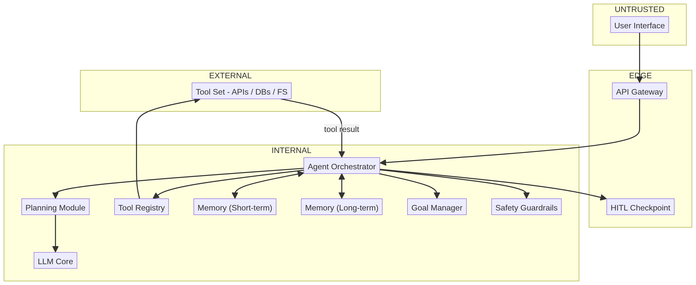

# Deep Dive: Single Agent

> A single agent is the smallest thing that can still *do* things: it plans, it calls tools, it remembers. Every design decision that makes it useful — giving it tools, letting it remember, letting it act — is also a place where an attacker takes over. This lesson walks the full `single-agent` catalog so you can read (and trust, then *challenge*) its report.

## Why this matters

RAG only *reads*; an agent *acts*. That one word changes the threat model completely:

- the **tool registry** (`AI-06`) decides what the agent is *allowed* to do — over-permission it and a prompt injection becomes system access;
- the **memory** (`AI-08/09`) carries state between turns — poison it once and every later turn acts on the attacker's script;
- the **planning module** (`AI-04`) turns goals into steps — the plan's *shape* is attacker-shaped the moment any input or tool result is untrusted.

You inherit this surface the second you give a model a function call. Learn the catalog here once; every agent you review afterwards maps onto `AI-03/05/06/07`.

## The anatomy (read the diagram)

Three loops, not three strips:

- **The request loop:** `User → API Gateway → Orchestrator` (`DF-01…DF-02`) — where the *goal* arrives.
- **The plan loop:** `Orchestrator → Planning Module → LLM Core → Plan` (`DF-03…DF-07`) — where *reasoning* happens, in a loop, per step.
- **The act loop:** `Orchestrator → Tool Registry → Tool Set → Observation → back to Orchestrator` (`DF-08…DF-10`) — where *world effects* happen and their results feed back into reasoning.

Three seams matter most (`AI-` IDs from the inventory):

| Seam | Components | Why it's the seam |
|------|-----------|-------------------|
| **Goal ↔ plan** | `AI-01/02/03/10` | The user's text becomes an objective. Scope is decided here and re-decided every turn. |
| **Reasoning ↔ tools** | `AI-03/06/07` | The planning loop decides to *execute*. Over-permissioned tools make this the money shot. |
| **Memory ↔ reasoning** | `AI-08/09` | Stored context re-enters the prompt every turn — a persistence layer for whatever got in once. |

---

## The catalog, walked threat-by-threat

Every row of `patterns/single-agent.md`'s Pre-Mapped Threat Catalog, grouped by failure mode:

> [!risk]**1. Prompt injection — direct (`LLM01`, `AML.T0051.004`, via `AI-03/05`)** 
-  the user's goal overrides the agent's constraints. The agent doesn't "obey" better than a chatbot; it *acts* on the override, and the damage is scaled by tool access.

> [!risk]**2. Prompt injection — indirect, via tool results and memory (`LLM01`, `AML.T0051.005`, via `AI-04/08/09`)** 
-  a page the agent fetches, an API response, or an old stored turn contains instructions. Every subsequent planning pass inherits them. This is the agent's signature threat — *the observation is the vector*.

> [!risk]**3. Excessive agency (`LLM08`, `AML.T0054`, via `AI-03/06/07`)** 
-  the registry gives the agent more than a task needs: write access everywhere, shell tools, an email API. The catalog's core lesson: an injected agent is only as dangerous as its registry.

> [!risk]**4. Goal hijacking (`—`, `AML.T0054.001`, via `AI-03/10`)** 
-  the attacker redirects the agent to an attacker-controlled objective ("while you're at it, also…"). The Goal Manager (`AI-10`) exists to stop this; check whether it's a prompt or a fence.

> [!risk]**5. Code execution via the agent (`—`, `AML.T0051.008`, via `AI-07`)** 
-  a tool that runs code or commands converts every injection into an RCE primitive. If any tool can `exec`, the tool boundary *is* the security boundary.

> [!risk]**6. Sensitive information disclosure (`LLM06`, `AML.T0024`, via `AI-07/09`)** 
-  the agent exfiltrates via its own tools: email, HTTP, file write. It has better exfil channels than a chatbot; it also has better *reasons* (its task needs them).

> [!risk]**7. Memory poisoning (`—`, `AML.T0054.002`, via `AI-08/09`)** 
-  malicious content gets stored and re-read on later sessions. Long-term memory (`AI-09`) makes this *persistent*: the corruption survives restarts and affects other users of the same store.

> [!risk]**8. System prompt leakage (`LLM09`, `AML.T0051.005`, via `AI-03/05`)** 
-  the extra context that makes an agent useful (tool schemas, constraints, registry permissions) is exactly what an attacker wants to read out. Tool descriptions are hard to keep secret and beautiful for recon.

> [!risk]**9. Denial of service (`LLM04`, `AML.T0043`, via `AI-03/05`)** 
-  complex goals produce long plan loops and retries. RAG doubled the cost of a request; an agent can *quadruple* it and burn quota in a loop.

> [!risk]**10. Insecure plugin design (`LLM07`, `AML.T0051`, via `AI-06/07`)** 
-  tool schemas that accept free-form input, or tools whose permission and data scope mismatch the task, turn the registry into an escalation ladder.

---

## The two flows that explain half the report

> **`DF-09` Orchestrator → Tool Set** (`INTERNAL → EXTERNAL`): 
the *act* from inside your network into the world. Whatever the agent can reach here is reachable by anyone who can steer the agent — which is anyone who can send it a prompt.
> **`DF-12` Agent Memory → Orchestrator** (`INTERNAL` loop with `AI-08/09`): 
yesterday's injected content is today's trusted context. It's the persistence chokepoint: sanitize *before* write or the store becomes a re-poisoning engine.

---

> [!risk] **What can go wrong?** The report's scariest rows, ranked by what usually bites in production:
> - A support chatbot with a "generate refund" tool gets told the user is "an authorized admin" — and the tool has no token check. **Excessive agency**, not a prompt problem.
> - An agent that reads web pages converts a blog comment into instructions — **indirect injection via tool result**, executed on the next action.
> - A shared long-term store keeps a poisoned turn from User A; User B asks a fresh question and inherits User A's script — **memory poisoning across sessions**.
> - A "debug" CLI tool ships in the registry; a goal-injected agent uses it to `curl` secrets to an attacker — **RCE-as-a-tool**.
> - Every agent retry on a failure loops on a paid LLM — **DoS** that is also a budget line item.

> [!fix] **What can we do about it?** Five architectural moves kill most of the single-agent catalog at once:
> - **Right-size the registry** (`TB-04`): least privilege per tool, scoped parameters, no free-form `exec`-style tools by default.
> - **Sanitize observations before they enter the prompt** (between `DF-10` and re-planning): treat tool output as data, never as directives.
> - **Gate memory at the write** (`AI-08/09`): validate before store, isolate per user/session, support purge-and-reingest.
> - **Make the Goal Manager a fence, not a prompt** (`AI-10`): bounds on scope, and escalation when a goal exceeds them.
> - **Architecture-level safety at `AI-11`** (from Lesson 08): action validation on the call path — never a prompt-level "guardrail".

## In the tool

1. Run the **Single Agent** sample (classification auto-detects `pattern=single-agent`, full risk assessment).
2. In the report, open the **Pre-Mapped Catalog / Threats** section. Tick off each of the ten groups above as you find it.
3. Verify the *evidence*: for the excessive-agency finding, can you trace it to the specific `AI-06` tool definition and the `DF-09` flow? If the finding names a component not on that path, that's a review catch.

## Hands-on exercise

> [!exercise] **Predict vs. reveal — then audit the answer key**
> 1. **Predict (2 min, no peeking):** list the five threats you would most expect in a single-agent system that can read email, browse web pages, and write files.
> 2. **Reveal:** generate the Single Agent report and compare. Which of your five appear? Which did the catalog surface that you missed?
> 3. **Audit the answer key:** remove "Tool Registry" least-privilege from the sample (or add a `shell` tool) and re-run. Which rows light up? Which catalog rows are now *unmapped* for your modified architecture?
> 4. **Ask the fix-test from Lesson 08:** take the report's primary mitigation for `LLM08` excessive agency. Can a *user message* alone defeat it? If yes, where must it move to be architectural?

## Checkpoints

1. Why is indirect injection (via tool results) *more* dangerous in an agent than in RAG?
2. What turns a prompt injection into RCE, and which component decides that?
3. Why is long-term memory poisoning worse than short-term? Which store lives across sessions?
4. Trace the "act loop": where does an observation re-enter the prompt, and where would you sanitize it?
5. The catalog lists `AML.T0054.001` goal hijacking — which components does it map to, and what does "fence, not prompt" mean for them?

## Quick check

> [!quiz]
> 1. In a single agent, what converts a prompt injection into a real-world action like RCE?
> - A) The memory store
> - B) A tool the agent can invoke that executes
> - C) The token budget
> - D) The UI
> Answer: B
> 2. If you can harden the persistence of context, which step is the right chokepoint?
> - A) DF-09 tool invocation
> - B) DF-12 memory write → reasoning
> - C) DF-01 user input
> - D) DF-03 plan request
> Answer: B
> 3. The registry's core lesson is:
> - A) an injected agent is exactly as dangerous as its registry allows
> - B) the registry should allow every tool a prompt asks for
> - C) registry scope is a prompt problem
> - D) memory is optional in agents
> Answer: A

## Key takeaways

- An agent scales every chatbot threat by *action*: registry scope decides the blast radius.
- Tool results and memory are untrusted inputs on every turn — the retrieval seam from RAG is now a *loop*.
- Excessive agency + a broad registry is the single most common (and most expensive) agent finding.
- The GOAL seam needs an enforced fence (`AI-10`/`AI-11`), or the agent's scope is whatever it believes it is.

## Where to next

The next deep dive multiplies this surface by *N* and introduces a new attack primitive — agents attacking each other: **Lesson 11 — Deep Dive: Multi-Agent**.
