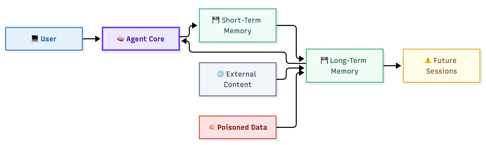

## Agent Memory Security

> Memory is where today's prompts become tomorrow's behavior. **Without memory:** A successful attack often ends with the session. **With memory:** The attack survives. Memory transforms temporary influence into persistence. Most AI security guidance focuses on prompts. Experienced attackers focus on memory. A poisoned prompt may affect one answer. **A poisoned memory can affect thousands.**

## Why this matters

Modern agents increasingly retain:

- user preferences
- conversation history
- retrieved facts
- plans
- observations
- tool outputs
- business context

Memory improves usefulness. Memory also creates a new attack surface.

> Attackers view memory as persistence. Threat modelers should too.

Unlike classic application state, AI memory directly influences future reasoning.

That makes memory both:

- a datastore
- an instruction source

The second property creates unique security challenges.

## The anatomy (read the diagram)

Most agent architectures contain two forms of memory:

| Type | Purpose |
|--------|--------|
| Short-Term Memory | Current conversation and task context |
| Long-Term Memory | Persistent knowledge across sessions |

Three seams matter most:

| Seam | Components | Why It Matters |
|--------|--------|--------|
| User ↔ Memory | Input becomes durable state |
| Agent ↔ Memory | Reasoning writes future behavior |
| Memory ↔ Agent | Stored information influences future reasoning |

The most important question:

Is the memory being treated as data or instructions?

Attackers want it treated as instructions.

## The catalog, walked threat-by-threat

> [!risk] **1. Memory Poisoning**

An attacker intentionally stores harmful content.

Examples:

- hidden instructions
- malicious goals
- preference manipulation
- retrieval triggers

The attack survives after the original session ends.

> [!risk] **2. Memory Exfiltration**

Stored information is disclosed to unauthorized users.

Examples:

- chat histories
- personal information
- business data
- internal conversations

Memory often contains more sensitive information than prompts.

> [!risk] **3. Cross-Session Leakage**

One user's memory influences another user's session.

Examples:

- shared memory stores
- tenant isolation failures
- retrieval collisions
- context contamination

This is one of the most common architectural mistakes.

> [!risk] **4. False Fact Persistence**

Hallucinated information becomes stored information.

Examples:

- invented records
- fabricated decisions
- incorrect business facts
- non-existent references

Once stored, the hallucination acquires undeserved credibility.

> [!risk] **5. Goal Manipulation**

Stored goals alter future decision making.

Examples:

- vendor preference manipulation
- business objective tampering
- agent priority changes
- instruction persistence

The attacker influences future planning indirectly.

> [!risk] **6. Privilege Persistence**

Temporary permissions become permanent behavior.

Examples:

- remembered elevated actions
- retained administrative workflows
- excessive

> [!risk] **7. Memory Replay**

Old instructions become active again.

Examples:

- outdated business rules
- expired approvals
- historical actions replayed as current intent

Older information is often trusted more than it should be.

> [!risk] **8. Long-Term Narrative Capture**

An attacker slowly shapes memory over time.

Examples:

- repeated false information
- gradual instruction insertion
- persistent influence campaigns

No individual action appears dangerous.

The accumulated result is.
--

## The two flows that explain half the report

> **DF-12 User → Memory**

This is the persistence boundary.

User input transforms into durable state.

The most important question:

Should this information be stored at all?

> **DF-13 Memory → Agent**

This is the trust boundary.

Stored content returns to influence future reasoning.

The most important question:

Why should the system trust this information?

Many memory attacks cross both flows.

---

> [!risk] **What can go wrong?**
> 
> - Prompt injection survives for weeks.
> - One user's information appears in another session.
> - Hallucinations become trusted knowledge.
> - Old instructions quietly override new goals.
> - Business decisions become biased by poisoned memory.
> - Shared-state systems amplify a single compromise.
> - Memory bypasses front-end safety controls.

> [!fix] **What can we do about it?**
> 
> - Isolate memory by user and session.
> - Require approval before long-term writes.
> - Expire memory automatically.
> - Track source attribution and provenance.
> - Separate conversational memory from enterprise knowledge.
> - Validate memory before reuse.
> - Monitor memory write activity.
> - Treat stored context as untrusted until verified.

## In the tool

Open any pattern report.

Locate:

- short-term memory
- long-term memory
- write paths
- read paths
- shared-state stores

Now ask:

Can untrusted information reach memory?

Can memory influence future behavior?

If both answers are yes, persistence exists.

## Hands-on exercise

> [!exercise]
> **Design a memory policy**
>
> Choose one architecture pattern.
>
> For every memory store define:
>
> - what can be written
> - who can write
> - who can read
> - retention period
> - deletion process
>
> If memory were compromised today:
>
> - how many future sessions would be affected?
> - how long would the compromise survive?
>
> Reduce that number until the blast radius becomes acceptable.

## Checkpoints

- Why does memory create persistence?
- Why is memory a trust boundary?
- How does memory poisoning differ from prompt injection?
- Which memory threat affects multiple users?
- Why are hallucinations dangerous when stored?
- What makes shared memory higher risk than isolated memory?
- Why should provenance exist for memory entries?

## Quick check
> [!quiz]
> Test your understanding before moving on.
>
> 1. Why is memory poisoning considered a persistence attack?
> - A) It increases token usage
> - B) It survives beyond the original session
> - C) It modifies embeddings
> - D) It improves retrieval
> Answer: B
>
> 2. Which flow reintroduces stored instructions into future reasoning?
> - A) User → Agent
> - B) Agent → Tool
> - C) Memory → Agent
> - D) Provider → Agent
> Answer: C
>
> 3. Which control is strongest against cross-session leakage?
> - A) Better prompts
> - B) Lower temperature
> - C) Memory Isolation
> - D) Larger context windows
> Answer: C

## Key takeaways

- Memory introduces persistence.
- Persistence changes attacker economics.
- Memory is both a datastore and an instruction source.
- Stored context should never be automatically trusted.
- Isolated memory is safer than shared memory.
- Provenance and retention controls are critical.
- Memory poisoning often produces delayed and difficult-to-diagnose failures.
- Every memory write deserves the same scrutiny as a retrieval source.

## Where to next

Memory becomes even more dangerous when multiple agents share state and collaborate.

The next lesson examines delegation, coordination, collusion, and shared-memory risk:

**Lesson 11 — Deep Dive: Multi-Agent**

 > [!quiz]
> Test your understanding before moving on.
>
> 1. Why is memory poisoning considered a persistence attack?
> - A) It increases token usage
> - B) It survives beyond the original session
> - C) It changes embeddings
> - D) It improves retrieval
> Answer: B
>
> 2. Which flow reintroduces stored instructions into future reasoning?
> - A) User → Agent
> - B) Agent → Tool
> - C) Memory → Agent
> - D) Provider → Agent
> Answer: C
>
> 3. Which control is strongest against cross-session leakage?
> - A) Better prompts
> - B) Lower temperature
> - C) Memory isolation
> - D) Larger context windows
> Answer: C

