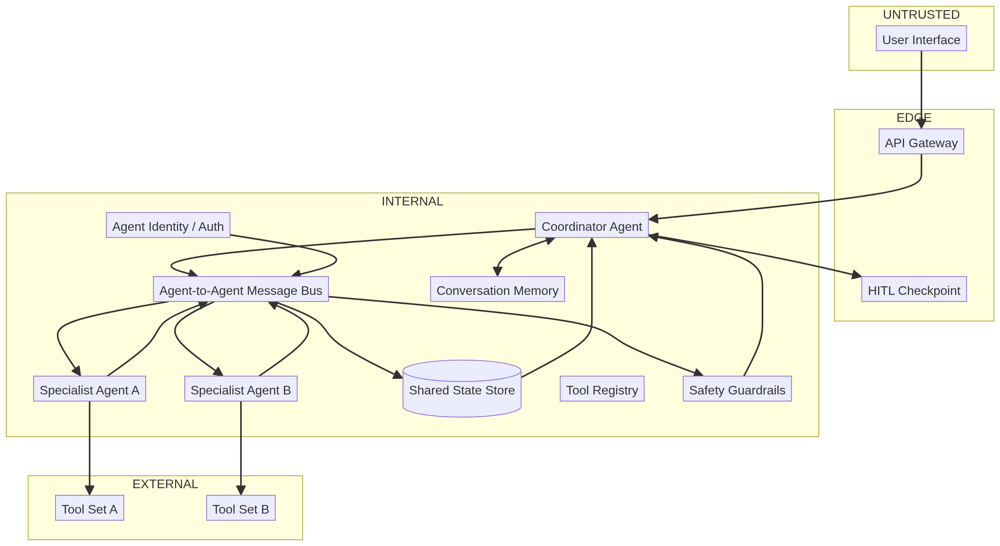

# Deep Dive: Multi-Agent

> A single agent trusted its tools and its memory. A multi-agent system *also* trusts other agents — over a message bus, through shared state, and down delegation chains. Every hop an agent trusts is a hop an attacker can infect, and multi-agent systems forget to attach trust boundaries **between** the agents themselves.
>  This lesson walks the full `multi-agent` catalog so you can spot the inter-agent seams in any design.

## Why this matters

More agents do not mean more brains; they mean more attack surface and — critically — more *paths between* high-value components:

- the **message bus** (`AI-06`) carries context between agents — an injection there spreads like it was on a shared wire;
- the **shared state** (`AI-07`) is written by any agent and read by all — one poisoned writer corrupts every reader;
- the **delegation chain** (`AI-03 → AI-04/05`) lets a compromised agent escalate its *reach* by leaning on another agent's tools.

The system already learned RAG's lesson (stored content is untrusted). Multi-agent systems often forget the harder one: **your own agents' outputs are untrusted inputs to each other.**

---

## The anatomy (read the diagram)

> - **The delegation strip:** 
    **-->** `User → Coordinator → Message Bus → Specialist A/B` (`DF-01…DF-04`) — where tasks and *context* travel between agents.

> - **The tool strip:** 
    **-->** `Specialist A/B → Tool Set A/B → results back onto the bus` (`DF-05…DF-07`) — per-agent tools, per-agent trust.

> - **The state strip:** 
    **-->** `Bus → Shared State → Coordinator` (`DF-08…DF-09`) — accumulated results become the coordinator's context.

> - **The oversight strip:** 
    **-->** `Any Agent → HITL → Coordinator` (`DF-11…DF-12`) — one human edge shared by every agent.

---

**Three seams matter most:**

| Seam | Components | Why it's the seam |
|------|-----------|-------------------|
| **Agent ↔ bus** | `AI-04/05/06` | Delegated messages carry *context*. Receivers can't tell a task from a script. |
| **Agent ↔ shared state** | `AI-07` | Written by all, read by all. There is no "per-agent" write validation. |
| **Agent ↔ agent** | `AI-14/06` | Identity and auth decide whether a fake agent can speak to anyone. Often defaults to "anyone can post". |

---

## The catalog, walked threat-by-threat

Every row of Multi-Agent's Pre-Mapped Threat Catalog, grouped by failure mode:

> [!grid=risk]
> **1. Direct prompt injection against any agent (`LLM01`, `AML.T0051.004`, via `AI-03/04/05`)** 
> -  more agents = more doors. The coordinator is the obvious one; specialists are the ones people sandbox last.
> ---
> **2. Multi-agent injection (`LLM01`, `AML.T0051.006`, via `AI-04/05/06`)** 
> -  an injected agent passes poisoned context onto the bus; the next agent executes instructions it never would have accepted from a user. *Injection now propagates*: this is single-agent indirect injection with transport.
> ---
> **3. Excessive agency via delegation (`LLM08`, `AML.T0054`, via `AI-03/04/05/06`)** 
> -  a specialist's tool becomes reachable through the coordinator. Delegation chains quietly compose *permissions*: agent A's reach caps ≥ the union of everyone it can ask.
> ---
> **4. Collusion (`—`, `AML.T0054.003`, via `AI-04/05`)** 
> -  two agents develop an unintended cooperative loop (A asks B, B asks A) that amplifies an error into an autonomous cycle. The catalog's reason executor-vs-planner pairs need mutual vetoes.
> ---
> **5. Agent impersonation (`—`, `AML.T0051.007`, via `AI-14/06`)** 
> -  a fake agent joins the bus and posts responses. No per-message sender authentication = any producer can be anyone. This is the multi-agent analog of a spoofing IDS finding.
> ---
> **6. Sensitive information disclosure via the bus/shared state (`LLM06`, `AML.T0024`, via `AI-06/07`)** 
> -  data meant for one specialist sits on a bus or in shared state that everyone reads. The shared store is an unusually *attractive* target: one read exfiltrates cross-agent context.
> ---
> **7. Shared state poisoning (`—`, `AML.T0054.002`, via `AI-07`)** 
> -  a malicious agent (or a poisoned tool result it writes) corrupts state used by all agents simultaneously. Instead of poisoning N sessions, you poison the one thing N sessions read.
> ---
> **8. System prompt leakage (`LLM09`, `AML.T0051.005`, via `AI-03`)** 
> -  the coordinator's prompt carries the *delegation map*: who can do what, which tools exist, where the seams are. Perfect recon for the impersonation attacks above.
> ---
> **9. Cascade denial of service (`LLM04`, `AML.T0043`, via `AI-04/05/06`)** 
> -  one agent's failure triggers retries that fan out across the bus to every other agent, multiplying quota and latency. Failure modes get *composed* too.
> ---
> **10. Insecure plugin design per role (`LLM07`, `AML.T0051`, via `AI-08/09/10`)** 
> -  tool permissions are provisioned per *agent role* at `AI-08`. When roles are over-broad, the delegation chain becomes an escalation ladder to everyone's tools.

---

## The two flows that explain half the report

> [!grid=callout]
> **`DF-02` Coordinator → Message Bus** 
> 
> (`INTERNAL → INTERNAL`): 
> the delegation hop. The coordinator trusts the *context it sends*; every specialist a hop later trusts it too. This is where multi-agent injection propagates — sanitize context at the bus, not just at the edge.
> ---
> **`DF-08` Message Bus → Shared State** 
>
> (`INTERNAL → INTERNAL`): 
> the accumulation hop. All agents write, all agents read. Make writes validated and isolated per agent, or one bad writer owns the aggregate.

---

> [!risk] **What can go wrong?** The report's scariest rows, ranked by what usually bites in production:
> - Agent A's tool output becomes Agent B's instructions because the message bus forwards context verbatim — **multi-agent injection** on `DF-02/03`.
> - A "research" agent posts a poisoned summary to shared state; every downstream agent + the coordinator reads it — **shared-state poisoning** on `DF-08`.
> - No sender auth on the bus, so a fabricated agent answers a delegation and steers the coordinator — **agent impersonation**.
> - Planner asks executor, executor "improves" the plan, round and round — **collusion** burns the request budget and loops.
> - User data meant for Agent A ends up in shared state that Agent B (and its tools) can read — **disclosure through aggregation**.

> [!fix] **What can we do about it?** Five architectural moves kill most of the multi-agent catalog at once:
> - **Authenticate and scope every message** (`TB-02`, `AI-14/06`): signed, sender-verified, role-checked bus messages; replay protection.
> - **Isolate shared state per writer** (`TB-04`, `AI-07`): validated, quota'd, per-agent namespaces instead of one shared pool.
> - **Sanitize at the delegation hop** (`DF-02/03`): strip instruction-like content from task context, exactly as you would from a tool result.
> - **Veto-capable coordinator** (`AI-03`): delegation must not compose unlimited permission — each specialist call is re-scoped to that agent's role (least privilege per *edge*, not per host).
> - **Per-agent HITL reachability** (`AI-12`): escalations from any agent, and mutual vetoes between collusion-prone pairs (planner ↔ executor).

## In the tool

1. Run the **Multi-Agent** sample (classification auto-detects `pattern=multi-agent`, full risk assessment).
2. In the report, open the **Pre-Mapped Catalog / Threats** section. Tick off each of the ten groups above as you find it.
3. Verify the *evidence*: for the multi-agent injection finding, trace the chain `AI-04 → bus → AI-05`. Which `DF-` id carries the poisoned context, and where would you insert the sanitizer?

## Hands-on exercise

> [!exercise] **Predict vs. reveal — then audit the answer key**
> 1. **Predict (2 min, no peeking):** the coordinator, the bus, and shared state are three obvious targets. Which three attack chains do you think the catalog ranks highest for a planner + executor + researcher trio?
> 2. **Reveal:** generate the Multi-Agent report and compare. Which of your chains appear? Which did you miss (check: collusion, impersonation)?
> 3. **Audit the answer key:** add a fourth agent with a *different* trust level (e.g., "code reviewer" with read access to a repo that the others can't see). Which rows change? Where did the catalog assume symmetric trust and go quiet?
> 4. **Ask the fix-test from Lesson 08:** the report's primary mitigation for `AML.T0051.006` multi-agent injection — can it be defeated by a single crafted message on the bus? If yes, move it to an architectural control on `TB-02`.

## Checkpoints

1. What makes multi-agent injection a *propagating* attack that single-agent indirect injection is not?
2. Name the component that, if poisoned, affects all agents at once, and the two `DF-` ids that make it possible.
3. How does a delegation chain compose tool permissions — and where must least privilege actually live?
4. What does "veto-capable coordinator" mean concretely in the planner/executor collusion threat?
5. Which components map to `AML.T0051.007` impersonation, and what one control closes it?

## Quick check

> [!quiz]
> 1. Why does multi-agent injection propagate so fast?
> - A) It travels on the message bus, and peers trust other agents' output as valid input
> - B) The bus amplifies randomness
> - C) Multi-agent systems have no guardrails
> - D) Injection is louder in a team
> Answer: A
> 2. Poisoning the shared state affects:
> - A) one agent only
> - B) every agent that reads that state next
> - C) just the coordinator's logs
> - D) only external tools
> Answer: B
> 3. Which control closes agent-impersonation on the bus?
> - A) A stronger system prompt
> - B) Per-message sender authentication with identity checks
> - C) Adding more agents
> - D) Promising to be careful in the plan
> Answer: B

## Key takeaways

- Your agents' outputs are untrusted inputs to each other — trust boundaries must exist *between* agents.
- The bus and the shared state are the two interval points; one bad writer poisons all readers.
- Delegation composes permissions; scope every delegation edge to the *receiving* agent's role.
- Sender identity + validation on the bus kills both impersonation and most multi-agent injection.

## Where to next

The final deep dive removes the last human constraint entirely and adds goal drift, self-modification, and a kill switch: **Lesson 12 — Deep Dive: Autonomous Agent**.
