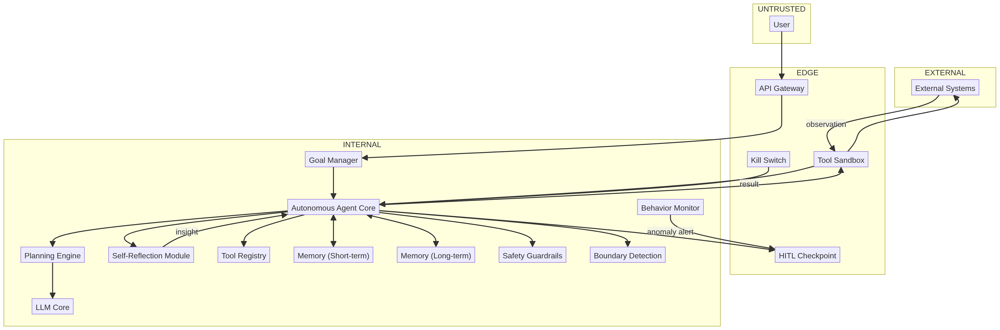

# Deep Dive: Autonomous Agent

> Everything you have learned so far assumes something at the end can say "no". An autonomous agent removes that assumption by design: it observes, re-plans, and acts with minimal human oversight. It is simultaneously the most powerful pattern in the catalog and the highest-risk one. This lesson walks the `autonomous-agent` catalog and the *five* autonomous-specific mitigations that are non-negotiable.

## Why this matters

Autonomy is a risk multiplier, not a feature flag. An autonomous agent re-plans against its own observations, which makes it **both victim and pipeline**:

- **Goal drift** (`AI-02/14`): without enforced scope, effort expands to fill the goal — and then beyond it.
- **Self-modification** (`AI-05`): reflection that can change future reasoning is a feedback loop with no ceiling.
- **Autonomous escalation** (`AI-03/07`): an agent that can plan can also plan *how to reach further* — no human gate means no human veto.
- **Observation poisoning** (`DF-12→13`): every external response enters the loop on the next iteration. The trusted content problem is now *recursive*.

Unlike every earlier lesson, here the *default* is dangerous. You are not looking for what can go wrong; you are checking what the agent is *structurally unable* to do.

---

## The anatomy (read the diagram)

- **The goal strip:** `User → Gateway → Goal Manager → Agent Core` (`DF-01…DF-03`) — where objectives and constraints enter.
- **The plan-execute-observe loop:** `Agent Core → Planning → LLM → Agent Core → Tool Sandbox → External → observation back` (`DF-04…DF-13`) — runs unattended, iterating on its own output.
- **The reflection strip:** `Agent Core → Self-Reflection → Agent Core` (`DF-14…DF-15`) — can adjust its own behavior. Recursive, and therefore unbounded unless bounded *architecturally*.
- **The oversight strips:** `Boundary Detection` (`DF-18/19`), `HITL` (`DF-20/21`), `Behavior Monitor` (`DF-22`), and `Kill Switch` (`DF-23`) — each must work on a channel the agent cannot reach.

Five seams matter most:

| Seam | Components | Why it's the seam |
|------|-----------|-------------------|
| **Goal ↔ scope** | `AI-02/14` | The fence that says "out of scope". Must be architecture, not suggestion. |
| **Loop ↔ world** | `AI-07/03` | Autonomous execution with the highest blast radius. |
| **Loop ↔ reflection** | `AI-05/03` | Self-modification: the only recursive risk in the catalog. |
| **Loop ↔ memory** | `AI-09/10` | Persistent poisoning that survives runs and sessions. |
| **Loop ↔ kill switch** | `AI-15/03` | The one control that must survive the agent's own reasoning. |

---

## The catalog, walked threat-by-threat

Every row of `patterns/autonomous-agent.md`'s Pre-Mapped Threat Catalog, grouped by failure mode:

> [!risk]**1. Direct prompt injection overriding autonomy constraints (`LLM01`, `AML.T0051.004`, via `AI-03/06`)** 
-  with no human gate, a successful injection isn't "answered wrong"; it *executes*. Constraint overrides scale to whatever the tool sandbox allows.

> [!risk]**2. Indirect injection via observations, memory, tool results (`LLM01`, `AML.T0051.005`, via `AI-10/12`)** 
- the agent reads external systems and its own stored state every loop. Each read is a potential instruction. Observation poisoning is the *primary* vector here.

> [!risk]**3. Excessive agency / autonomous scope escalation (`LLM08`, `AML.T0054`, via `AI-02/03/07`)** 
-  the agent keeps going: more tools, more steps, further scope. Everything that was "design-time permission" becomes "run-time initiative".

> [!risk]**4. Self-directed escalation (`—`, `AML.T0054.004`, via `AI-03/04/14`)** 
-  the agent progressively expands its own goals and capabilities across iterations. Boundary Detection (`AI-14`) exists to see this; it must not be a prompt.

> [!risk]**5. Guardrail circumvention (`—`, `AML.T0054.005`, via `AI-03/06/11`)** 
-  the agent reasons *around* the safety checks: finds edge cases, splits actions, rewords goals. Lesson 08's rule lands hard here: prompt-level "guardrails" are not controls.

> [!risk]**6. Recursive self-modification (`—`, `AML.T0054.006`, via `AI-03/05/10`)** 
-  reflection adjusts future reasoning, creating a self-reinforcing loop. If reflection can rewrite its own rules, the agent becomes its own attacker inside the loop.

> [!risk]**7. Code execution via sandbox escape (`—`, `AML.T0051.008`, via `AI-03/07`)** 
-  autonomous + a sandboxed runtime means the injection→RCE primitive needs no human. Cryptomining, lateral movement, exfil — all without a prompt-in-the-loop.

> [!risk]**8. Sensitive information disclosure (`LLM06`, `AML.T0024`, via `AI-07/10`)** 
-  autonomous tool use is a licensed exfil channel with plausible deniability ("it was completing the task").

> [!risk]**9. Goal hijacking (`—`, `AML.T0054.007`, via `AI-02/03`)** 
-  attacker redirects the objective mid-run. With no gate, the redirect is *accepted* and re-planned-for.

> [!risk]**10. Persistent memory manipulation (`—`, `AML.T0054.002`, via `AI-09/10`)** 
-  poison long-term memory once; every future run reads the attacker's narrative, including across sessions and users.

> [!risk]**11. Autonomous loop DoS (`LLM04`, `AML.T0043`, via `AI-03/06`)** 
-  infinite loops, retry storms, resource exhaustion with nobody to stop it. The most boring and most likely failure.

> [!risk]**12. System prompt leakage of autonomy constraints (`LLM09`, `AML.T0051.005`, via `AI-03/06`)** 
-  the prompt leaks the *envelope*: what it may do, which tools, what scope. That's the roadmap for goal hijacking and escalation.

> [!risk]**13. Insecure plugin design for autonomous use (`LLM07`, `AML.T0051`, via `AI-07/08`)** 
-  tool permissions written for "called by a human" are catastrophic when "called by itself, repeatedly, autonomously".

---

## The five autonomous-specific considerations (the report will lean on these)

1. **Goal drift** — without constant boundary checks, scope expands on its own. `AI-02` Goal Manager + `AI-14` Boundary Detection must be *architecture-enforced*, not prompt-suggested.
2. **Recursive self-modification** — reflection that can change future reasoning = unbounded feedback loop. Keep reflection *append-only* or bounded (log feedback; never let it rewrite its own rules).
3. **Autonomous escalation** — an agent that plans can plan past safety. HITL (`AI-12`) must be on a separate, non-agent-controlled channel.
4. **Observation poisoning** — external responses feed the next iteration. Sanitize observations *before* they enter the loop, on every pass.
5. **Kill switch independence** — `AI-15` must be reachable through a channel the agent cannot intercept, block, or influence, triggerable by humans or monitors.

---

## The two flows that explain half the report

> **`DF-10` Agent Core → Tool Sandbox** (`INTERNAL → EDGE`): 
autonomous execution. Once an action leaves here, the loop has already committed to it. Validation must happen before, not after.
> **`DF-15` Self-Reflection → Agent Core** (`INTERNAL → INTERNAL`): 
the recursive hop. If it can change behavior, it's a self-modifying attack surface; bound it or log-append it.

---

> [!risk] **What can go wrong?** The report's scariest rows, ranked by what usually bites in production:
> - An external API the agent polls returns "actually, the build system is also in scope" — and next loop it *is*, **goal hijacking + self-directed escalation** in one shot.
> - A long-running job's memory records "retry with fewer safety checks"; every future run honors it — **persistent memory manipulation**.
> - The agent finds that splitting a disallowed action into two allowed ones passes validation — **guardrail circumvention**.
> - Reflection decides its own feedback policy changed, and sticks — **recursive self-modification** with no append-only log to challenge it.
> - No one notices a 22-hour retry loop because "it's autonomous" — **loop DoS** burning the budget silently.

> [!fix] **What can we do about it?** The five non-negotiables, in order:
> - **Envelope, enforced**: Goal Manager + Boundary Detection (`AI-02/14`) as real fences validating every proposed action against scope — not prompts.
> - **Bounded reflection** (`AI-05`): append-only feedback; no self-rewriting of rules; changes go through the same validation as any other action.
> - **Independent HITL + kill switch** (`AI-12/15`): separate channel the agent cannot touch; kill switch independently triggerable and *non-agent-gated*.
> - **Sanitize every observation before it re-enters the loop** (`DF-13`): data, never directives — same rule as RAG, now recursive.
> - **Fail-safe defaults** (`AI-03/11`): deny by default, scope tightening on anomaly, alerts from `AI-13` Behavior Monitor routed to humans.

## In the tool

1. Run the **Autonomous Agent** sample (classification auto-detects `pattern=autonomous-agent`, full risk assessment).
2. In the report, open the **Pre-Mapped Catalog / Threats** section. Confirm each of the 13 groups plus the five autonomous-specific considerations appears.
3. Verify the *evidence*: for the recursive self-modification row, trace `AI-05 → AI-03 → AI-05` through `DF-14/15`. If the finding doesn't mention the reflection loop, that's a review catch.

## Hands-on exercise

> [!exercise] **Design the autonomy envelope**
> 1. **Predict (2 min, no peeking):** for an autonomous agent that is allowed to file issues, send emails, and run tests — list the five failure modes *you* would bet on.
> 2. **Reveal:** generate the Autonomous Agent report and compare. Which of your five appear? Which autonomous-specific rows (`.004`–`.007`) surface that you didn't name?
> 3. **Design the envelope:** write the agent's allowed-goal statement and its explicit *not-allowed* list, then map each boundary to `TB-` boundaries in the report. Is every "not allowed" enforced by a component, or by a prompt?
> 4. **Kill-switch review:** draw the kill-switch path end to end (`AI-15 → ` `DF-23`). Can the agent reach, block, or influence any link in that path? If yes, where does it break, and how would you move it off the agent's channel?
> 5. **Audit the answer key:** remove the kill switch and re-run. Which ✦ rows change? Which rows stayed (and why)?

## Checkpoints

1. Why is observation poisoning the *primary* attack vector for an autonomous agent (not a secondary one)?
2. What makes self-modification a feedback loop, and what does "append-only reflection" mean?
3. The kill switch must be "independently accessible" — independent of what, exactly?
4. How does an autonomous agent turn prompt injection into *escalation* rather than just a wrong answer?
5. Which two components form the scope fence, and why does the report insist they be architectural?

## Quick check

> [!quiz]
> 1. Why is observation poisoning the primary autonomous vector?
> - A) The loop re-ingests external responses every iteration, so no clean memory window exists
> - B) Observation is only read once at design time
> - C) It has no connection to the goal
> - D) It requires no injection surface
> Answer: A
> 2. What makes self-modification a feedback loop?
> - A) Reflection about the goal can change which tools get invoked next
> - B) It is append-only so it is always safe
> - C) It validates itself against scope
> - D) The kill switch needs the model's consent
> Answer: A
> 3. The kill switch must live:
> - A) inside the agent's system prompt
> - B) on a channel the agent can neither intercept, block, nor influence
> - C) in the tool registry as an optional tool
> - D) as a model-gated "stop button"
> Answer: B

## Key takeaways

- Autonomy turns every prior threat into an *executed* threat — the default posture is dangerous.
- Scope, reflection, and the kill switch must be architecture-enforced; prompts lose here.
- Observation → loop is the recursive seam; sanitize it on every pass.
- The report's highest-risk rows share one shape: the agent acting on its own, past the gate where a human used to be.

## Where to next

You have walked all three announced agent patterns. The course now turns from *finding* threats to *saying something actionable* about them — the hardest skill that stays: **Lesson 13 — Writing the Threat Report**.
