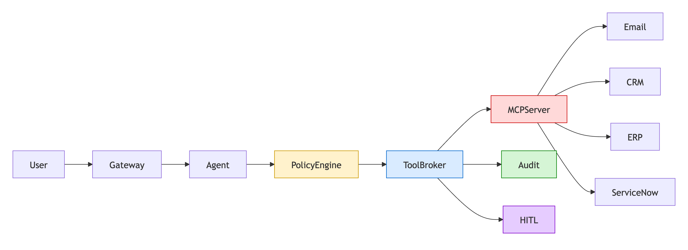

## MCP & Tool Ecosystem Security

> Models create value by reasoning. Tools create value by acting. The moment an AI system can send email, create tickets, update records, run workflows, execute code, access databases, or invoke APIs, the attack surface changes dramatically.

 - Prompt injection becomes tool abuse.

 - Hallucinations become unauthorized actions.

 - Reasoning becomes business impact.

This lesson explores the security risks introduced by MCP servers, tool registries, plugins, action frameworks, and enterprise integrations.

## Why this matters

Most successful AI incidents do not involve the model becoming "evil."

They involve the model doing exactly what it was allowed to do.

The danger is rarely the model.

The danger is the authority behind the model.

Modern AI systems increasingly have access to:

- enterprise applications
- databases
- file systems
- ticketing platforms
- messaging systems
- workflow engines
- external APIs

Every permission granted to a tool becomes part of the attack surface.

Threat modeling tool ecosystems means understanding how authority, identity, trust, and permissions flow through the architecture.

## What is MCP?

Model Context Protocol (MCP) provides a standardized way for AI systems to interact with external tools and services.

Conceptually:

```text
Model
 ↓
MCP Client
 ↓
MCP Server
 ↓
Enterprise System
```

MCP enables structured discovery, invocation, and execution of actions.

The security implication:

The model may only suggest actions.

The MCP ecosystem performs them.

## The anatomy (read the diagram)


images/mcp-tool-ecosystem-security.png

The architecture can be viewed in four layers:

### Request Layer

User
→ API Gateway
→ Agent

Receives requests.

### Decision Layer

Agent
→ Policy Engine
→ Tool Broker

Determines what should occur.

#### Action Layer

Tool Broker
→ MCP Server
→ Enterprise Systems

Executes actions.

#### Oversight Layer

Monitoring
→ Audit
→ HITL

Verifies actions remain acceptable.

Three seams matter most:

| Seam | Components | Why It Matters |
|--------|--------|--------|
| Intent ↔ Action | Agent / Tool Broker | Reasoning becomes execution |
| Tool ↔ Permission | Tool Broker / MCP Server | Authority is granted |
| Action ↔ Enterprise | MCP Server / External System | Business impact occurs |

## The catalog, walked threat-by-threat

### 1. Tool Abuse

OWASP: LLM06

ATLAS: AML.T0054

The model legitimately calls a tool.

The purpose becomes illegitimate.

Examples:

- deleting records
- sending unauthorized emails
- changing approvals
- creating false transactions

The tool behaves correctly.

The request does not.

### 2. Capability Escalation

ATLAS: AML.T0054

The agent gains access to capabilities beyond its intended scope.

Examples:

- read-only becoming read-write
- reporting tools becoming administrative tools
- workflow execution beyond authorization boundaries

This usually originates from poor permission design.

### 3. Tool Impersonation

An attacker introduces a malicious tool that appears legitimate.

Examples:

- rogue MCP endpoints
- compromised plugins
- spoofed services

The AI system trusts the wrong component.

### 4. Context Poisoning Through Tool Responses

Tools return information.

The model treats it as trusted.

Examples:

- malicious API responses
- hidden instructions
- manipulated metadata
- tool-generated prompt injection

Tool output should be treated as data.

Attackers want it treated as instructions.

### 5. Credential Misuse

Secrets used by tools become targets.

Examples:

- API keys
- service principals
- OAuth tokens
- delegated permissions

Compromising tool credentials often bypasses the model entirely.

### 6. Excessive Permission Inheritance

The agent receives permissions intended for humans.

Examples:

- administrator capabilities
- unrestricted file access
- elevated business privileges

Least privilege is frequently forgotten during AI deployments.

### 7. Cross-Tool Chaining

Individual tools appear safe.

Combined together they become dangerous.

Examples:

Read Email
→ Extract Information
→ Send Email
→ Modify Ticket
→ Delete Logs

No single action appears suspicious.

The chain is.

### 8. Supply Chain Compromise

A third-party component becomes malicious.

Examples:

- plugins
- frameworks
- MCP servers
- integration packages

The trusted extension becomes the attack path.

### 9. Audit Evasion

Actions occur without visibility.

Examples:

- incomplete logging
- missing attribution
- insufficient telemetry

What cannot be investigated cannot be trusted.

## The two flows that explain half the report

### DF-08 Agent → Tool Broker

This is the intent boundary.

Everything before this point is reasoning.

Everything after this point is execution.

Many organizations mistakenly place controls after execution has already begun.

### DF-11 Tool Broker → Enterprise System

This is the business-impact boundary.

Once a request crosses this line:

- records may change
- money may move
- emails may send
- workflows may trigger

The highest-value controls belong on this flow.

## MCP-specific security questions

When reviewing a design ask:

- How are MCP servers discovered?
- Who approves MCP servers?
- Can servers be impersonated?
- What permissions does each server expose?
- How are actions logged?
- What requires HITL approval?
- How are credentials protected?
- What prevents excessive agency?

These questions identify most MCP-related weaknesses.

## Real-world attack chain

A common attack chain:

Prompt Injection
→ Tool Selection Manipulation
→ MCP Invocation
→ Unauthorized Action
→ Data Exfiltration

The prompt was not the impact.

The tool invocation was.

## Five design rules

### Rule 1

Tools are authority.

Treat them like privileged administrators.

### Rule 2

Policy must live outside the model.

Models suggest.

Policies decide.

### Rule 3

Every tool requires least privilege.

Reduce blast radius before compromise occurs.

### Rule 4

Audit every action.

If an action cannot be reconstructed later, risk increases.

### Rule 5

Trust tool outputs as data, not instructions.

Otherwise APIs become prompt-injection sources.

---

> [!risk] **What can go wrong?**
> 
> - A prompt causes the model to invoke legitimate tools for illegitimate purposes.
> - A malicious MCP server impersonates a trusted service.
> - Hidden instructions arrive through tool output.
> - Enterprise permissions exceed business requirements.
> - Tool chains create unexpected privilege escalation.
> - Unauthorized actions execute before review.
> - Poor logging conceals the incident.

> [!fix] **What can we do about it?**
> 
> - Apply least privilege to every tool.
> - Use a policy engine outside the model.
> - Require approval for sensitive actions.
> - Validate MCP server identity.
> - Audit all tool invocations.
> - Limit credential scope.
> - Monitor action chains, not only individual actions.
> - Treat tool outputs as untrusted until validated.

## In the tool

Open the Single-Agent pattern.

Locate:

- Tool Registry
- Goal Manager
- HITL Checkpoint

Now identify:

- authority boundaries
- permission boundaries
- execution boundaries

Ask:

"What real-world action could happen if this component were compromised?"

Repeat for every tool-facing component.

## Hands-on exercise

> [!exercise] Design a safe tool
> 
> Select one enterprise capability:
> 
> - Email
> - ServiceNow
> - Salesforce
> - SAP
> - Database Access
> 
> For that tool define:
> 
> - minimum permissions
> - maximum permissions
> - approval requirements
> - logging requirements
> - emergency disable process
> 
> Now ask:
> 
> Would the business still function?
> 
> If not, precisely which permission must be added?
> 
> Every added permission becomes part of the threat model.

## Checkpoints

- Why are tools higher risk than prompts?
- Why does authority matter more than intelligence?
- What is excessive permission inheritance?
- Why should policies exist outside the model?
- What is cross-tool chaining?
- Which boundary creates business impact?
- Why must tool responses be treated as untrusted?

## Quick check
> [!quiz]
> Test your understanding before moving on.
>
> 1. A valid tool performing an unauthorized action is an example of:
> - A) Model Theft
> - B) Tool Abuse
> - C) Hallucination
> - D) Retrieval Manipulation
> Answer: B
>
> 2. What control most effectively reduces blast radius?
> - A) Larger Context Window
> - B) Prompt Engineering
> - C) Least Privilege
> - D) Additional Guardrails
> Answer: C
>
> 3. Tool output should be treated as:
> - A) Trusted Instructions
> - B) Trusted System Prompts
> - C) Verified Facts
> - D) Untrusted Data
> Answer: D
>
> 4. A prompt causes a valid tool to perform an invalid action. What occurred?
> - A) Supply Chain Compromise
> - B) Tool Abuse
> - C) Model Extraction
> - D) Hallucination
> Answer: B
>
> 5. Which control most directly limits tool authority?
> - A) Larger Context Window
> - B) Tool Allowlist
> - C) Temperature Setting
> - D) Prompt Template
> Answer: B
>
> 6. Why is least privilege important for tools?
> - A) Improves latency
> - B) Improves token efficiency
> - C) Reduces blast radius
> - D) Improves embeddings
> Answer: C


## Key takeaways

- Tools are authority.
- Authority defines blast radius.
- MCP systems shift risk from prompts to actions.
- Policy enforcement should occur outside the model whenever possible.
- Tool outputs must be treated as untrusted data.
- Least privilege is the most effective way to reduce business impact.
- Auditability is a security control, not merely an operational feature.
- Cross-tool chaining can create risks that are invisible when individual actions are reviewed in isolation.

## Where to next

You now understand how authority, permissions, MCP servers, and tools can be abused.

The next lesson moves beyond finding threats and focuses on validating security controls under attack:

**Lesson 12B — AI Red Teaming & Adversarial Validation**