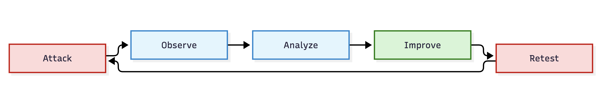

## AI Red Teaming & Adversarial Validation

> Threat models are predictions. Red teaming tests whether those predictions are real. An AI system is not secure because a control exists. It is secure only when the control survives attack.

This lesson focuses on adversarial validation, AI red teaming, and continuous testing.

## Why this matters

Every lesson before this one asked:

"What could go wrong?"

**Red teaming asks:**

> "Can we prove it?"

> [!grid] Security teams often deploy:
> 
> - guardrails
> - HITL
> - retrieval controls
> - memory isolation
> - policy enforcement

without validating them.

> Red teaming turns assumptions into evidence.

---

## The anatomy (read the diagram)

**The cycle:**

    Attack
    → Observe
    → Analyze
    → Improve
    → Retest

The objective is not to break the system.

> The objective is to discover weaknesses before attackers do.

## The four testing targets

> [!grid=callout] 
> **1. Instructions**
> 
> Can prompts override intended behavior?
> 
> Examples:
> 
> - jailbreaking
> - prompt injection
> - role confusion
> - hidden instruction attacks
> ---
> **2. Data**
> 
> Can knowledge sources manipulate behavior?
> 
> Examples:
> 
> - document poisoning
> - memory poisoning
> - retrieval manipulation
> - vector poisoning
> ---
> **3. Tools**
> 
> Can actions be abused?
> 
> Examples:
> 
> - unauthorized transactions
> - privilege escalation
> - excessive agency
> - tool chaining
> ---
> **4. Autonomy**
> 
> Can constraints be bypassed?
> 
> Examples:
> 
> - goal drift
> - recursive escalation
> - self-modification
> - policy bypass

---
## The catalog, walked threat-by-threat

> [!grid=risk] 
> **1. Prompt Injection Testing**
> 
> Attempt:
> 
> - direct injection
> - indirect injection
> - context-confusion attacks
> 
> ***Objective:***
> 
> Override intended instructions.
> ---
> **2. Retrieval Security Testing**
> 
> Attempt:
> 
> - poisoned documents
> - ranking manipulation
> - unauthorized retrieval
> 
> ***Objective:***
> 
> Influence reasoning through data.
> ---
> **3. Memory Security Testing**
> 
> Attempt:
> 
> - memory poisoning
> - memory replay
> - persistence attacks
> 
> ***Objective:***
> 
> Influence future behavior.
> ---
> **4. Tool Abuse Testing**
> 
> Attempt:
> 
> - unauthorized actions
> - privilege escalation
> - excessive agency
> 
> ***Objective:***
> 
> Extend impact beyond the model.
> ---
> **5. Agent Coordination Testing**
> 
> Attempt:
> 
> - message poisoning
> - delegation abuse
> - shared-state manipulation
> 
> ***Objective:***
> 
> Propagate compromise between agents.
> ---
> **6. Autonomy Testing**
> 
> Attempt:
> 
> - boundary escape
> - self-modification
> - reflection abuse
> 
> ***Objective:***
> 
> Identify runaway behavior.
> 

---

## The three metrics that matter

> **1. Attack Success Rate**

How often did the attack succeed?

> **2. Detection Rate**

How often was the attack detected?

> **3. Recovery Rate**

How quickly was the system restored?

These metrics are often more useful than model accuracy.

---

## The two flows that explain half the lesson

> [!grid=callout] 
> **DF-ATTACK**
>
> Adversarial Input → System
> 
> Can the attack influence behavior?
> ---
> **DF-RECOVERY**
> 
> Detection → Response → Restoration
> 
> Can the system recover safely?

---

## Common red-team mistakes

> [!grid=risk]
> **Mistake 1**
> 
> Testing only prompts.
> 
> Most real attacks involve:
> 
> - memory
> - retrieval
> - tools
> - autonomy
> ---
> **Mistake 2**
> 
> Testing only the model.
> 
> Most incidents occur in surrounding systems.
> ---
> **Mistake 3**
> 
> Testing once.
> 
> Security controls drift.
> 
> Red teaming should be continuous.

---

> [!risk] **What can go wrong?**
> 
> - A prompt bypasses controls.
> - Poisoned documents survive ingestion.
> - Memory retains malicious instructions.
> - Agents delegate compromised information.
> - Autonomous systems expand scope.
> - Tool permissions exceed intended authority.
> 
> A threat model that has never been tested remains a hypothesis.

> [!fix] **What can we do about it?**
> 
> - Test regularly.
> - Test retrieval.
> - Test memory.
> - Test tools.
> - Test autonomy.
> - Measure attack success.
> - Validate mitigations after every change.

---

## In the tool

Open any pattern report.

Select three findings.

Now ask:

How would I prove this finding is exploitable?

Document:

- attack scenario
- expected behavior
- successful outcome
- mitigation

Repeat for all three.

---

## Hands-on exercise

> [!exercise] Build a red-team plan
> 
> Choose one architecture pattern.
> 
> Create:
> 
> - three prompt attacks
> - two retrieval attacks
> - one memory attack
> - one tool abuse attack
> 
> Now define:
> 
> - expected result
> - successful attack condition
> - defensive control
> 
> Which control fails first?

---

## Checkpoints

- Why is red teaming different from threat modeling?
- Why should retrieval be tested?
- Why should memory be tested?
- Why is tool testing critical?
- What metric demonstrates defensive effectiveness?
- Why should testing be continuous?

---

## Quick check
> [!quiz]
> Test your understanding before moving on.
>
> 1. What is the primary purpose of AI Red Teaming?
> - A) Improve model accuracy
> - B) Reduce token costs
> - C) Validate security controls under attack
> - D) Improve grounding
> Answer: C
>
> 2. A threat model that has never been tested is:
> - A) Verified
> - B) Production Ready
> - C) Complete
> - D) A Hypothesis
> Answer: D
>
> 3. Which attack surface is most commonly overlooked during testing?
> - A) Memory
> - B) Gateway
> - C) Browser
> - D) Logging
> Answer: A

## Scenario quiz
> [!quiz]
>
> 1. A poisoned PDF successfully bypasses ingestion controls and manipulates retrieval. What category was tested?
> - A) Retrieval Security
> - B) Tool Abuse
> - C) Agency Testing
> - D) Audit Testing
> Answer: A
>
> 2. A red team convinces an agent to repeatedly invoke an email tool it legitimately owns. What was tested?
> - A) Memory Leakage
> - B) Tool Abuse
> - C) Model Extraction
> - D) Hallucination
> Answer: B
>
> 3. An attacker stores hidden instructions that affect future sessions. What category was exercised?
> - A) Prompt Testing
> - B) Memory Testing
> - C) Supply Chain
> - D) Hallucination
> Answer: B
>
> 4. An autonomous agent gradually expands the tasks it considers in-scope. What category was tested?
> - A) Retrieval
> - B) Grounding
> - C) Autonomy
> - D) Logging
> Answer: C
>
> 5. A control blocks 90 out of 100 attacks. What metric improved?
> - A) Detection Rate
> - B) Attack Success Rate
> - C) Context Window
> - D) Retrieval Accuracy
> Answer: B

---

## Key takeaways

- Threat models predict risk.
- Red teams validate risk.
- Retrieval, memory, tools, and autonomy must be tested.
- Security controls require continuous validation.
- Security evidence is stronger than security assumptions.
- Effective red teams improve systems before attackers do.

## Where to next

You now understand how to identify threats and validate them.

Next:

Lesson 12c – OWASP Agentic AI Top 10 (the agent-specific failure-mode catalogue), then Lesson 13.