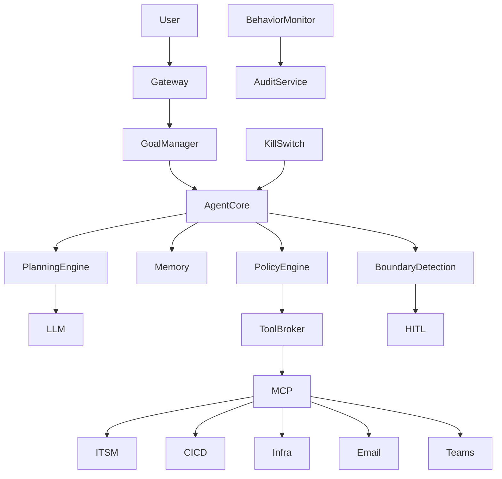
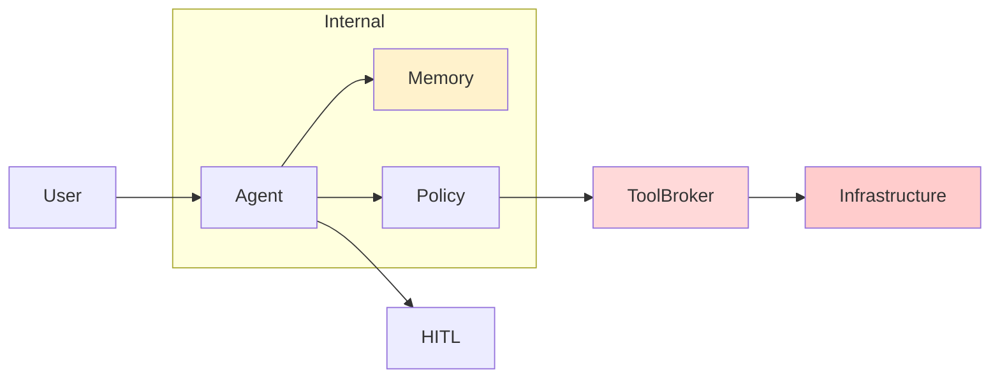
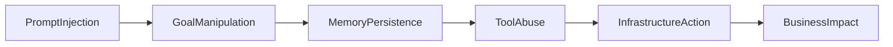
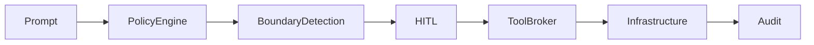

# Capstone #3 Instructor Guide
# Autonomous Change Management Agent

This answer guide provides exemplar answers.

Many answers are valid.

Use this guide to evaluate:

- Completeness
- Reasoning
- Threat Identification
- Architecture Understanding
- Control Selection

---

# Architecture Overview

This capstone combines every major risk area in the course:

- RAG
- Memory
- MCP
- Tooling
- Governance
- Autonomy
- Reflection
- Planning
- Kill Switches
- Red Teaming

The primary challenge:

The system can act without immediate human approval.

This dramatically increases risk.

---

# Reference Architecture Diagram

---

# Part 1 – Component Inventory

Expected Components

| AI-ID | Component |
|---------|---------|
| AI-01 | User |
| AI-02 | Gateway |
| AI-03 | Goal Manager |
| AI-04 | Agent Core |
| AI-05 | Planning Engine |
| AI-06 | LLM Provider |
| AI-07 | Long-Term Memory |
| AI-08 | Retrieval Layer |
| AI-09 | Knowledge Base |
| AI-10 | Policy Engine |
| AI-11 | Tool Broker |
| AI-12 | MCP Server |
| AI-13 | ITSM Platform |
| AI-14 | CI/CD Platform |
| AI-15 | Infrastructure API |
| AI-16 | Email System |
| AI-17 | Teams System |
| AI-18 | Boundary Detection |
| AI-19 | HITL Gateway |
| AI-20 | Behavior Monitor |
| AI-21 | Audit Service |
| AI-22 | Kill Switch |

Minimum Expected:

18+

Full Credit:

20+

---

# Part 2 – Data Flows

Critical Flows

| DF-ID | Flow |
|---------|---------|
| DF-01 | User → Gateway |
| DF-02 | Gateway → Goal Manager |
| DF-03 | Goal Manager → Agent Core |
| DF-04 | Agent Core → Planning Engine |
| DF-05 | Planning Engine → LLM |
| DF-06 | Agent Core → Memory |
| DF-07 | Memory → Agent Core |
| DF-08 | Agent Core → Retrieval |
| DF-09 | Agent Core → Policy Engine |
| DF-10 | Policy Engine → Tool Broker |
| DF-11 | Tool Broker → MCP |
| DF-12 | MCP → ITSM |
| DF-13 | MCP → CI/CD |
| DF-14 | MCP → Infrastructure |
| DF-15 | MCP → Email |
| DF-16 | MCP → Teams |
| DF-17 | Agent → Boundary Detection |
| DF-18 | Boundary Detection → HITL |
| DF-19 | Behavior Monitor → Audit |
| DF-20 | Kill Switch → Agent Core |

Critical Scoring Flows

DF-07 (memory)

DF-11 (tool invocation)

DF-14 (infrastructure action)

DF-20 (kill switch)

---

# Part 3 – Trust Boundaries

Expected

| TB-ID | Boundary |
|---------|---------|
| TB-01 | Human Boundary |
| TB-02 | Provider Boundary |
| TB-03 | Memory Boundary |
| TB-04 | Tool Boundary |
| TB-05 | Infrastructure Boundary |
| TB-06 | Approval Boundary |
| TB-07 | Monitoring Boundary |
| TB-08 | Kill-Switch Boundary |

Highest-Risk Boundary

Tool Boundary

Reason:

This boundary converts planning into execution.

---

# Trust Boundary Diagram

---

# Part 4 – OWASP Analysis

Expected Findings

| Threat | OWASP |
|---------|---------|
| Direct Prompt Injection | LLM01 |
| Indirect Prompt Injection | LLM01 |
| Disclosure | LLM02 |
| Supply Chain | LLM04 |
| Poisoning | LLM05 |
| Improper Output Handling | LLM10 |
| Excessive Agency | LLM03 |
| Hidden Context Exposure | LLM08 |
| Retrieval Manipulation | LLM09 |
| Misinformation | LLM07 |
| Unbounded Consumption | LLM06 |

Expected Response

10+

Full Credit

12+

---

# Part 5 – MITRE ATLAS

Expected

| Threat | ATLAS |
|---------|---------|
| Injection | AML.T0051 |
| Poisoning | AML.T0020 |
| Disclosure | AML.T0024 |
| Extraction | AML.T0025 |
| DoS | AML.T0043 |
| Supply Chain | AML.T0010 |
| Excessive Agency | AML.T0054 |

Full Credit

5+

Mappings

---

# Part 6 – STRIDE

Expected Examples

| STRIDE | Example |
|---------|---------|
| Spoofing | Fake Agent Identity |
| Tampering | Memory Manipulation |
| Repudiation | Missing Audit Trail |
| Information Disclosure | Change Plan Exposure |
| DoS | Autonomous Looping |
| Elevation of Privilege | Unauthorized Infrastructure Actions |

Minimum:

Two examples per category.

---

# Part 7 – Autonomous Risks

Expected Findings

1. Goal Drift
2. Autonomous Escalation
3. Recursive Reflection Abuse
4. Observation Poisoning
5. Kill Switch Bypass
6. Guardrail Circumvention
7. Boundary Evasion
8. Tool Chaining
9. Scope Expansion
10. Runaway Planning

Highest-Risk Finding

Autonomous Escalation

Reason

System can create its own impact path.

---

# Part 8 – Memory Security

Expected Findings

| Threat |
|---------|
| Memory Poisoning |
| Replay |
| Goal Manipulation |
| Shared-State Corruption |
| False Fact Persistence |
| Privilege Persistence |
| Instruction Persistence |

Highest-Risk Memory Threat

Goal Manipulation

Reason

Future planning becomes attacker-controlled.

---

# Part 9 – MCP & Tool Security

Expected Findings

1. Tool Abuse
2. MCP Server Impersonation
3. Credential Theft
4. Capability Escalation
5. Excessive Permissions
6. Action Chaining
7. Unauthorized Infrastructure Changes

Highest-Risk Flow

Tool Broker → Infrastructure

Reason

Immediate operational impact.

---

# Part 10 – Governance Review

Expected Findings

1. Inadequate Oversight
2. Missing Human Approval
3. Insufficient Audit Trails
4. Ambiguous Accountability
5. Incident Response Gaps
6. Regulatory Exposure
7. Change Traceability Gaps

Highest-Risk Governance Issue

Lack of mandatory approval on high-risk changes.

---

# Part 11 – Expected Attack Chain

Example Answer

Reconnaissance

Learn deployment process

↓

Initial Access

Prompt Injection

↓

Execution

Goal Manipulation

↓

Persistence

Memory Poisoning

↓

Exfiltration

Infrastructure Information Export

↓

Impact

Unauthorized Production Changes

Alternative attack chains acceptable.

---

# Attack Chain Diagram

---

# Part 12 – Top Risks

Expected Top 10

1. Autonomous Escalation
2. Tool Abuse
3. Goal Drift
4. Memory Poisoning
5. Infrastructure API Abuse
6. MCP Server Abuse
7. Approval Bypass
8. Observation Poisoning
9. Kill Switch Failure
10. Privilege Persistence

---

# Part 13 – Mitigation Strategy

Expected Controls

| Threat | Control |
|---------|---------|
| Prompt Injection | Input Validation |
| Goal Drift | Boundary Detection |
| Tool Abuse | Policy Engine |
| Excessive Agency | Least Privilege |
| Memory Poisoning | Provenance Controls |
| MCP Abuse | Server Authentication |
| Reflection Abuse | Bounded Reflection |
| Escalation | HITL Approval |
| Runaway Loops | Loop Limits |
| Kill Switch Failure | Independent Control Channel |

Expected Highest-Value Control

Policy Engine

Acceptable Alternative

Boundary Detection

Reason

Both intercept dangerous actions before execution.

---

# Control Overlay Diagram

---

# Part 14 – Red Team Plan

Expected Tests

1. Direct Prompt Injection
2. Indirect Prompt Injection
3. Observation Poisoning
4. Memory Poisoning
5. Goal Drift
6. Reflection Abuse
7. MCP Impersonation
8. Tool Abuse
9. Approval Bypass
10. Kill Switch Validation

Full Credit

Includes:

- Attack
- Success Criteria
- Mitigation Validation

---

# Expert Challenge Answers

## Largest Blast Radius

Infrastructure APIs

Reason:

Production systems may be modified.

---

## What Creates Persistence?

Memory

Reason:

Instructions survive across sessions.

---

## What Creates Business Impact?

Tool Execution

Reason:

Actions affect real systems.

---

## Most Critical Trust Boundary

Tool Boundary

Reason:

Planning becomes execution.

---

## First Security Control To Implement

Policy Engine

Reason:

Stops unsafe actions before execution.

---

## Production Recommendation

Conditional Approval

Requirements:

- HITL for high-risk changes
- Policy Engine
- Boundary Detection
- Independent Kill Switch
- Full Audit Logging
- Red-Team Validation

Autonomous deployment without these controls should not be approved.

---

# Common Learner Mistakes

- Focusing only on prompt injection
- Ignoring memory persistence
- Missing reflection risks
- Forgetting kill-switch independence
- Treating MCP as "just another API"
- Ignoring governance and accountability
- Missing tool-to-infrastructure attack paths

---

# Scoring Guidance

| Score | Rating |
|---------|---------|
| 90-100 | Expert |
| 80-89 | Advanced |
| 70-79 | Proficient |
| 60-69 | Developing |
| Below 60 | Requires Additional Instruction |

---

# Facilitator Discussion Questions

1. Should infrastructure-changing agents ever be fully autonomous?
2. What controls should be mandatory before production use?
3. What would happen if memory became corrupted?
4. Which component creates the greatest concentration of risk?
5. What would a real-world attacker target first?
6. Is autonomy worth the additional security burden?
7. How would you safely roll this system back after compromise?